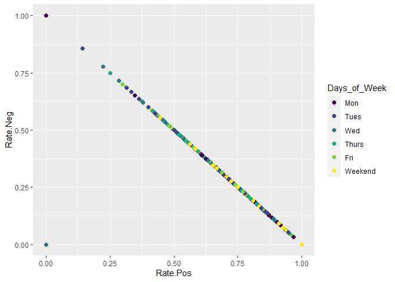

Project 2
================
Kristina Golden and Demetrios Samaras
2023-07-02

# Lifestyle

## Required Packages

``` r
library(tidyverse)
library(knitr)
library(GGally)
library(corrplot)
library(qwraps2)
library(vtable)
library(psych)
library(ggplot2)
library(cowplot)
library(caret)
library(gbm)
library(randomForest)
library(tree)
library(class)
library(bst)
library(reshape)
library(reshape2)
library(corrr)
library(ggcorrplot)
library(FactoMineR)
library(factoextra)
library(data.table)
```

## Introduction

In this report we will be looking at the Lifestyle data channel of the
online news popularity data set. This data set looks at a wide range of
variables from 39644 different news articles. The response variable that
we will be focusing on is **shares**. The purpose of this analysis is to
try to predict how many shares a Lifestyle article will get based on the
values of those other variables. We will be modeling shares using two
different linear regression models and two ensemble tree based models.

## Read in the Data

``` r
#setwd("C:/Documents/Github/ST_558_Project_2")
setwd("C:/Users/Demetri/Documents/NCSU_masters/ST558/Repos/ST_558_project_2_pages")
 

online <- read.csv("OnlineNewsPopularity.csv")
colnames(online) <- c('url', 'days', 'n.Title', 'n.Content', 'Rate.Unique', 
                      'Rate.Nonstop', 'Rate.Unique.Nonstop', 'n.Links', 
                      'n.Other', 'n.Images', 'n.Videos',
                      'Avg.Words', 'n.Key', 'Lifestyle', 'Entertainment',
                      'Business', 'Social.Media', 'Tech', 'World', 'Min.Worst.Key',
                      'Max.Worst.Key', 'Avg.Worst.Key', 'Min.Best.Key', 
                      'Max.Best.Key', 'Avg.Best.Key', 'Avg.Min.Key', 'Avg.Max.Key',
                      'Avg.Avg.Key', 'Min.Ref', 'Max.Ref', 'Avg.Ref', 'Mon', 
                      'Tues', 'Wed', 'Thurs', 'Fri', 'Sat', 'Sun', 'Weekend',
                      'LDA_00', 'LDA_01', 'LDA_02', 'LDA_03', 'LDA_04', 
                      'Global.Subj', 'Global.Pol', 'Global.Pos.Rate',
                      'Global.Neg.Rate', 'Rate.Pos', 'Rate.Neg', 'Avg.Pos.Pol',
                      'Min.Pos.Pol', 'Max.Pos.Pol', 'Avg.Neg.Pol', 'Min.Neg.Pol',
                      'Max.Neg.Pol', 'Title.Subj', 'Title.Pol', 'Abs.Subj',
                      'Abs.Pol', 'shares')
#Dropped url and timedelta because they are non-predictive. 
online <- online[ , c(3:61)]
```

## Write Functions

``` r
summary_table <- function(data_input) {
    min <- min(data_input$shares)
    q1 <- quantile(data_input$shares, 0.25)
    med <- median(data_input$shares)
    q3 <- quantile(data_input$shares, 0.75)
    max <- max(data_input$shares)
    mean1 <- mean(data_input$shares)
    sd1 <- sd(data_input$shares)
    data <- matrix(c(min, q1, med, q3, max, mean1, sd1), 
                   ncol=1)
    rownames(data) <- c("Minimum", "Q1", "Median", "Q3",
                           "Maximum", "Mean", "SD")
    colnames(data) <- c('Shares')
    data <- as.table(data)
    data
}
```

``` r
#Create correlation table and graph for a training dataset
correlation_table <- function(data_input) {
  #drop binary variables
  correlations <- cor(subset(data_input, select = c(2:4, 6:24,
                                                    33:50)))
  kable(correlations, caption = 'Correlations Lifestyle')
}
```

``` r
# Create correlation graph
correlation_graph <- function(data_input,sig=0.5){
  corr <- cor(subset(data_input, select = c(2:4, 6:24, 33:50)))
  corr[lower.tri(corr, diag = TRUE)] <- NA
  corr <- melt(corr, na.rm = TRUE)
  corr <- subset(corr, abs(value) > 0.5)
  corr[order(-abs(corr$value)),]
  print(corr)
  mtx_corr <- reshape2::acast(corr, Var1~Var2, value.var="value")
  corrplot(mtx_corr, is.corr=FALSE, tl.col="black", na.label=" ")
}
```

## Lifestyle EDA

### Lifestyle

``` r
## filters rows based on when parameter is 1 
data_channel <-  online %>% filter( !!rlang::sym(params$DataChannel) == 1)

## Drop the data_channel_is columns 
data_channel <- data_channel[ , -c(12:17)]

## reorder to put shares first 
data_channel <- data_channel[ , c(53, 1:52)]
```

``` r
set.seed(5432)

# Split the data into a training and test set (70/30 split)
# indices

train <- sample(1:nrow(data_channel), size = nrow(data_channel)*.70)
test <- setdiff(1:nrow(data_channel), train)

# training and testing subsets
data_channel_train <- data_channel[train, ]
data_channel_test <- data_channel[test, ]
```

## Lifestyle Summarizations

``` r
#Shares table for data_channel_train
summary_table(data_channel_train)
```

    ##             Shares
    ## Minimum     28.000
    ## Q1        1100.000
    ## Median    1700.000
    ## Q3        3200.000
    ## Maximum 208300.000
    ## Mean      3770.660
    ## SD        9802.024

The above table displays the Lifestyle 5-number summary for the shares.
It also includes the mean and standard deviation. Because the mean is
greater than the median, we suspect that the Lifestyle shares
distribution is right skewed.

``` r
#Correlation table for lifestyle_train
correlation_table(data_channel_train)
```

<table>
<caption>
Correlations Lifestyle
</caption>
<thead>
<tr>
<th style="text-align:left;">
</th>
<th style="text-align:right;">
n.Title
</th>
<th style="text-align:right;">
n.Content
</th>
<th style="text-align:right;">
Rate.Unique
</th>
<th style="text-align:right;">
Rate.Unique.Nonstop
</th>
<th style="text-align:right;">
n.Links
</th>
<th style="text-align:right;">
n.Other
</th>
<th style="text-align:right;">
n.Images
</th>
<th style="text-align:right;">
n.Videos
</th>
<th style="text-align:right;">
Avg.Words
</th>
<th style="text-align:right;">
n.Key
</th>
<th style="text-align:right;">
Min.Worst.Key
</th>
<th style="text-align:right;">
Max.Worst.Key
</th>
<th style="text-align:right;">
Avg.Worst.Key
</th>
<th style="text-align:right;">
Min.Best.Key
</th>
<th style="text-align:right;">
Max.Best.Key
</th>
<th style="text-align:right;">
Avg.Best.Key
</th>
<th style="text-align:right;">
Avg.Min.Key
</th>
<th style="text-align:right;">
Avg.Max.Key
</th>
<th style="text-align:right;">
Avg.Avg.Key
</th>
<th style="text-align:right;">
Min.Ref
</th>
<th style="text-align:right;">
Max.Ref
</th>
<th style="text-align:right;">
Avg.Ref
</th>
<th style="text-align:right;">
LDA_00
</th>
<th style="text-align:right;">
LDA_01
</th>
<th style="text-align:right;">
LDA_02
</th>
<th style="text-align:right;">
LDA_03
</th>
<th style="text-align:right;">
LDA_04
</th>
<th style="text-align:right;">
Global.Subj
</th>
<th style="text-align:right;">
Global.Pol
</th>
<th style="text-align:right;">
Global.Pos.Rate
</th>
<th style="text-align:right;">
Global.Neg.Rate
</th>
<th style="text-align:right;">
Rate.Pos
</th>
<th style="text-align:right;">
Rate.Neg
</th>
<th style="text-align:right;">
Avg.Pos.Pol
</th>
<th style="text-align:right;">
Min.Pos.Pol
</th>
<th style="text-align:right;">
Max.Pos.Pol
</th>
<th style="text-align:right;">
Avg.Neg.Pol
</th>
<th style="text-align:right;">
Min.Neg.Pol
</th>
<th style="text-align:right;">
Max.Neg.Pol
</th>
<th style="text-align:right;">
Title.Subj
</th>
</tr>
</thead>
<tbody>
<tr>
<td style="text-align:left;">
n.Title
</td>
<td style="text-align:right;">
1.0000000
</td>
<td style="text-align:right;">
0.0110788
</td>
<td style="text-align:right;">
-0.0299399
</td>
<td style="text-align:right;">
-0.0292103
</td>
<td style="text-align:right;">
-0.1102683
</td>
<td style="text-align:right;">
0.0184994
</td>
<td style="text-align:right;">
-0.0152067
</td>
<td style="text-align:right;">
-0.0029681
</td>
<td style="text-align:right;">
-0.0779939
</td>
<td style="text-align:right;">
-0.0798863
</td>
<td style="text-align:right;">
-0.0530870
</td>
<td style="text-align:right;">
0.0228746
</td>
<td style="text-align:right;">
-0.0063953
</td>
<td style="text-align:right;">
0.0053470
</td>
<td style="text-align:right;">
0.0749129
</td>
<td style="text-align:right;">
0.1409165
</td>
<td style="text-align:right;">
-0.0032850
</td>
<td style="text-align:right;">
-0.0026321
</td>
<td style="text-align:right;">
0.0162808
</td>
<td style="text-align:right;">
0.0512335
</td>
<td style="text-align:right;">
0.0313824
</td>
<td style="text-align:right;">
0.0512142
</td>
<td style="text-align:right;">
-0.0366395
</td>
<td style="text-align:right;">
0.0821186
</td>
<td style="text-align:right;">
0.0708543
</td>
<td style="text-align:right;">
-0.0077871
</td>
<td style="text-align:right;">
-0.0171024
</td>
<td style="text-align:right;">
-0.0710700
</td>
<td style="text-align:right;">
-0.0834255
</td>
<td style="text-align:right;">
-0.0523560
</td>
<td style="text-align:right;">
-0.0055210
</td>
<td style="text-align:right;">
-0.0430617
</td>
<td style="text-align:right;">
0.0029321
</td>
<td style="text-align:right;">
-0.1196140
</td>
<td style="text-align:right;">
-0.0491722
</td>
<td style="text-align:right;">
-0.0511522
</td>
<td style="text-align:right;">
0.0051632
</td>
<td style="text-align:right;">
0.0050987
</td>
<td style="text-align:right;">
-0.0142189
</td>
<td style="text-align:right;">
0.0524284
</td>
</tr>
<tr>
<td style="text-align:left;">
n.Content
</td>
<td style="text-align:right;">
0.0110788
</td>
<td style="text-align:right;">
1.0000000
</td>
<td style="text-align:right;">
-0.5179230
</td>
<td style="text-align:right;">
-0.3651876
</td>
<td style="text-align:right;">
0.3015521
</td>
<td style="text-align:right;">
0.1900089
</td>
<td style="text-align:right;">
0.4879406
</td>
<td style="text-align:right;">
0.0441036
</td>
<td style="text-align:right;">
0.0292420
</td>
<td style="text-align:right;">
0.0801110
</td>
<td style="text-align:right;">
-0.1164249
</td>
<td style="text-align:right;">
0.0161783
</td>
<td style="text-align:right;">
-0.0073094
</td>
<td style="text-align:right;">
0.0690303
</td>
<td style="text-align:right;">
0.1137872
</td>
<td style="text-align:right;">
0.0687721
</td>
<td style="text-align:right;">
0.0881707
</td>
<td style="text-align:right;">
0.0694450
</td>
<td style="text-align:right;">
0.1122453
</td>
<td style="text-align:right;">
-0.0001303
</td>
<td style="text-align:right;">
0.0419563
</td>
<td style="text-align:right;">
0.0254683
</td>
<td style="text-align:right;">
0.0678206
</td>
<td style="text-align:right;">
-0.0261978
</td>
<td style="text-align:right;">
-0.0200444
</td>
<td style="text-align:right;">
0.0766760
</td>
<td style="text-align:right;">
-0.0939653
</td>
<td style="text-align:right;">
0.1077615
</td>
<td style="text-align:right;">
0.0835293
</td>
<td style="text-align:right;">
0.1350869
</td>
<td style="text-align:right;">
0.0426196
</td>
<td style="text-align:right;">
0.0918491
</td>
<td style="text-align:right;">
-0.0018365
</td>
<td style="text-align:right;">
0.0949908
</td>
<td style="text-align:right;">
-0.2602193
</td>
<td style="text-align:right;">
0.3462956
</td>
<td style="text-align:right;">
-0.0954441
</td>
<td style="text-align:right;">
-0.3705757
</td>
<td style="text-align:right;">
0.2324525
</td>
<td style="text-align:right;">
0.0011818
</td>
</tr>
<tr>
<td style="text-align:left;">
Rate.Unique
</td>
<td style="text-align:right;">
-0.0299399
</td>
<td style="text-align:right;">
-0.5179230
</td>
<td style="text-align:right;">
1.0000000
</td>
<td style="text-align:right;">
0.9148541
</td>
<td style="text-align:right;">
-0.2252921
</td>
<td style="text-align:right;">
-0.1121176
</td>
<td style="text-align:right;">
-0.2907981
</td>
<td style="text-align:right;">
0.0098843
</td>
<td style="text-align:right;">
0.5806017
</td>
<td style="text-align:right;">
-0.1369419
</td>
<td style="text-align:right;">
0.0984607
</td>
<td style="text-align:right;">
-0.0452506
</td>
<td style="text-align:right;">
-0.0133399
</td>
<td style="text-align:right;">
-0.0579483
</td>
<td style="text-align:right;">
-0.0892984
</td>
<td style="text-align:right;">
-0.0931308
</td>
<td style="text-align:right;">
-0.0307488
</td>
<td style="text-align:right;">
-0.0613592
</td>
<td style="text-align:right;">
-0.1081669
</td>
<td style="text-align:right;">
0.0401228
</td>
<td style="text-align:right;">
0.0020135
</td>
<td style="text-align:right;">
0.0276824
</td>
<td style="text-align:right;">
-0.0473955
</td>
<td style="text-align:right;">
0.0433955
</td>
<td style="text-align:right;">
0.0001542
</td>
<td style="text-align:right;">
-0.1149242
</td>
<td style="text-align:right;">
0.1051411
</td>
<td style="text-align:right;">
0.2524087
</td>
<td style="text-align:right;">
0.0133601
</td>
<td style="text-align:right;">
0.0566932
</td>
<td style="text-align:right;">
0.1158168
</td>
<td style="text-align:right;">
0.2495182
</td>
<td style="text-align:right;">
0.1840770
</td>
<td style="text-align:right;">
0.2384819
</td>
<td style="text-align:right;">
0.3966118
</td>
<td style="text-align:right;">
-0.0824198
</td>
<td style="text-align:right;">
-0.1147582
</td>
<td style="text-align:right;">
0.1856373
</td>
<td style="text-align:right;">
-0.3259421
</td>
<td style="text-align:right;">
-0.0565348
</td>
</tr>
<tr>
<td style="text-align:left;">
Rate.Unique.Nonstop
</td>
<td style="text-align:right;">
-0.0292103
</td>
<td style="text-align:right;">
-0.3651876
</td>
<td style="text-align:right;">
0.9148541
</td>
<td style="text-align:right;">
1.0000000
</td>
<td style="text-align:right;">
-0.2702140
</td>
<td style="text-align:right;">
-0.0887240
</td>
<td style="text-align:right;">
-0.3862216
</td>
<td style="text-align:right;">
0.0092625
</td>
<td style="text-align:right;">
0.6010723
</td>
<td style="text-align:right;">
-0.1676945
</td>
<td style="text-align:right;">
0.0939193
</td>
<td style="text-align:right;">
-0.0386260
</td>
<td style="text-align:right;">
-0.0075402
</td>
<td style="text-align:right;">
-0.0642482
</td>
<td style="text-align:right;">
-0.0831774
</td>
<td style="text-align:right;">
-0.1280242
</td>
<td style="text-align:right;">
-0.0741199
</td>
<td style="text-align:right;">
-0.0769582
</td>
<td style="text-align:right;">
-0.1510221
</td>
<td style="text-align:right;">
0.0218479
</td>
<td style="text-align:right;">
0.0041338
</td>
<td style="text-align:right;">
0.0189516
</td>
<td style="text-align:right;">
0.0034647
</td>
<td style="text-align:right;">
0.0377854
</td>
<td style="text-align:right;">
0.0146458
</td>
<td style="text-align:right;">
-0.2348051
</td>
<td style="text-align:right;">
0.1418084
</td>
<td style="text-align:right;">
0.2823969
</td>
<td style="text-align:right;">
0.0047847
</td>
<td style="text-align:right;">
0.1141509
</td>
<td style="text-align:right;">
0.1740753
</td>
<td style="text-align:right;">
0.2945995
</td>
<td style="text-align:right;">
0.2212759
</td>
<td style="text-align:right;">
0.2671106
</td>
<td style="text-align:right;">
0.2925506
</td>
<td style="text-align:right;">
0.0281253
</td>
<td style="text-align:right;">
-0.1662731
</td>
<td style="text-align:right;">
0.0377063
</td>
<td style="text-align:right;">
-0.2461165
</td>
<td style="text-align:right;">
-0.0914118
</td>
</tr>
<tr>
<td style="text-align:left;">
n.Links
</td>
<td style="text-align:right;">
-0.1102683
</td>
<td style="text-align:right;">
0.3015521
</td>
<td style="text-align:right;">
-0.2252921
</td>
<td style="text-align:right;">
-0.2702140
</td>
<td style="text-align:right;">
1.0000000
</td>
<td style="text-align:right;">
0.2731710
</td>
<td style="text-align:right;">
0.4347634
</td>
<td style="text-align:right;">
0.0525431
</td>
<td style="text-align:right;">
0.1684971
</td>
<td style="text-align:right;">
0.2121596
</td>
<td style="text-align:right;">
-0.1556713
</td>
<td style="text-align:right;">
0.0162698
</td>
<td style="text-align:right;">
-0.0158459
</td>
<td style="text-align:right;">
0.1451405
</td>
<td style="text-align:right;">
0.1578786
</td>
<td style="text-align:right;">
0.1424023
</td>
<td style="text-align:right;">
0.1842874
</td>
<td style="text-align:right;">
0.1368765
</td>
<td style="text-align:right;">
0.2488977
</td>
<td style="text-align:right;">
0.0209764
</td>
<td style="text-align:right;">
0.0569355
</td>
<td style="text-align:right;">
0.0468429
</td>
<td style="text-align:right;">
0.0431287
</td>
<td style="text-align:right;">
-0.0718110
</td>
<td style="text-align:right;">
-0.1521932
</td>
<td style="text-align:right;">
0.2922028
</td>
<td style="text-align:right;">
-0.1580693
</td>
<td style="text-align:right;">
0.2636678
</td>
<td style="text-align:right;">
0.2133331
</td>
<td style="text-align:right;">
0.1416339
</td>
<td style="text-align:right;">
-0.0486469
</td>
<td style="text-align:right;">
0.1539406
</td>
<td style="text-align:right;">
-0.0671051
</td>
<td style="text-align:right;">
0.2194584
</td>
<td style="text-align:right;">
-0.0776824
</td>
<td style="text-align:right;">
0.3235884
</td>
<td style="text-align:right;">
-0.1061087
</td>
<td style="text-align:right;">
-0.1874251
</td>
<td style="text-align:right;">
0.0498500
</td>
<td style="text-align:right;">
0.0804441
</td>
</tr>
<tr>
<td style="text-align:left;">
n.Other
</td>
<td style="text-align:right;">
0.0184994
</td>
<td style="text-align:right;">
0.1900089
</td>
<td style="text-align:right;">
-0.1121176
</td>
<td style="text-align:right;">
-0.0887240
</td>
<td style="text-align:right;">
0.2731710
</td>
<td style="text-align:right;">
1.0000000
</td>
<td style="text-align:right;">
0.1927763
</td>
<td style="text-align:right;">
0.0275531
</td>
<td style="text-align:right;">
0.0575709
</td>
<td style="text-align:right;">
0.1700062
</td>
<td style="text-align:right;">
0.0919840
</td>
<td style="text-align:right;">
0.0535872
</td>
<td style="text-align:right;">
0.0635467
</td>
<td style="text-align:right;">
-0.0193591
</td>
<td style="text-align:right;">
-0.1175320
</td>
<td style="text-align:right;">
-0.1427653
</td>
<td style="text-align:right;">
-0.0287098
</td>
<td style="text-align:right;">
0.0129269
</td>
<td style="text-align:right;">
-0.0487213
</td>
<td style="text-align:right;">
-0.0196695
</td>
<td style="text-align:right;">
0.1449863
</td>
<td style="text-align:right;">
0.0725963
</td>
<td style="text-align:right;">
-0.0194528
</td>
<td style="text-align:right;">
0.0700835
</td>
<td style="text-align:right;">
-0.1214614
</td>
<td style="text-align:right;">
-0.0178995
</td>
<td style="text-align:right;">
0.0513940
</td>
<td style="text-align:right;">
0.0601585
</td>
<td style="text-align:right;">
0.1097929
</td>
<td style="text-align:right;">
0.0923294
</td>
<td style="text-align:right;">
-0.0893977
</td>
<td style="text-align:right;">
0.1488562
</td>
<td style="text-align:right;">
-0.0852634
</td>
<td style="text-align:right;">
0.0345210
</td>
<td style="text-align:right;">
-0.0897591
</td>
<td style="text-align:right;">
0.1130056
</td>
<td style="text-align:right;">
-0.0268304
</td>
<td style="text-align:right;">
-0.0338315
</td>
<td style="text-align:right;">
0.0239071
</td>
<td style="text-align:right;">
-0.0067873
</td>
</tr>
<tr>
<td style="text-align:left;">
n.Images
</td>
<td style="text-align:right;">
-0.0152067
</td>
<td style="text-align:right;">
0.4879406
</td>
<td style="text-align:right;">
-0.2907981
</td>
<td style="text-align:right;">
-0.3862216
</td>
<td style="text-align:right;">
0.4347634
</td>
<td style="text-align:right;">
0.1927763
</td>
<td style="text-align:right;">
1.0000000
</td>
<td style="text-align:right;">
-0.0564529
</td>
<td style="text-align:right;">
-0.0526545
</td>
<td style="text-align:right;">
0.1686526
</td>
<td style="text-align:right;">
-0.0852350
</td>
<td style="text-align:right;">
-0.0262038
</td>
<td style="text-align:right;">
-0.0533502
</td>
<td style="text-align:right;">
0.1134689
</td>
<td style="text-align:right;">
0.0895906
</td>
<td style="text-align:right;">
0.1483794
</td>
<td style="text-align:right;">
0.2003450
</td>
<td style="text-align:right;">
0.1057878
</td>
<td style="text-align:right;">
0.2498931
</td>
<td style="text-align:right;">
0.0487033
</td>
<td style="text-align:right;">
0.0357119
</td>
<td style="text-align:right;">
0.0488944
</td>
<td style="text-align:right;">
-0.0680730
</td>
<td style="text-align:right;">
-0.0453094
</td>
<td style="text-align:right;">
-0.1259183
</td>
<td style="text-align:right;">
0.4469373
</td>
<td style="text-align:right;">
-0.1902649
</td>
<td style="text-align:right;">
0.1905937
</td>
<td style="text-align:right;">
0.1665748
</td>
<td style="text-align:right;">
0.0717974
</td>
<td style="text-align:right;">
-0.0377173
</td>
<td style="text-align:right;">
0.0159384
</td>
<td style="text-align:right;">
-0.0604293
</td>
<td style="text-align:right;">
0.1687448
</td>
<td style="text-align:right;">
-0.0245293
</td>
<td style="text-align:right;">
0.1806496
</td>
<td style="text-align:right;">
-0.0820571
</td>
<td style="text-align:right;">
-0.1157283
</td>
<td style="text-align:right;">
0.0443254
</td>
<td style="text-align:right;">
0.1091487
</td>
</tr>
<tr>
<td style="text-align:left;">
n.Videos
</td>
<td style="text-align:right;">
-0.0029681
</td>
<td style="text-align:right;">
0.0441036
</td>
<td style="text-align:right;">
0.0098843
</td>
<td style="text-align:right;">
0.0092625
</td>
<td style="text-align:right;">
0.0525431
</td>
<td style="text-align:right;">
0.0275531
</td>
<td style="text-align:right;">
-0.0564529
</td>
<td style="text-align:right;">
1.0000000
</td>
<td style="text-align:right;">
-0.0065006
</td>
<td style="text-align:right;">
0.0282615
</td>
<td style="text-align:right;">
-0.0650308
</td>
<td style="text-align:right;">
0.0638704
</td>
<td style="text-align:right;">
0.0441592
</td>
<td style="text-align:right;">
0.0398809
</td>
<td style="text-align:right;">
0.0617208
</td>
<td style="text-align:right;">
0.1339735
</td>
<td style="text-align:right;">
0.0822040
</td>
<td style="text-align:right;">
0.0404606
</td>
<td style="text-align:right;">
0.0865687
</td>
<td style="text-align:right;">
0.0444637
</td>
<td style="text-align:right;">
0.0773941
</td>
<td style="text-align:right;">
0.0901189
</td>
<td style="text-align:right;">
-0.0188324
</td>
<td style="text-align:right;">
0.0177442
</td>
<td style="text-align:right;">
0.0159725
</td>
<td style="text-align:right;">
0.1309176
</td>
<td style="text-align:right;">
-0.0865452
</td>
<td style="text-align:right;">
0.0294136
</td>
<td style="text-align:right;">
-0.0028593
</td>
<td style="text-align:right;">
-0.0087140
</td>
<td style="text-align:right;">
0.0285786
</td>
<td style="text-align:right;">
-0.0105836
</td>
<td style="text-align:right;">
0.0137471
</td>
<td style="text-align:right;">
0.0309884
</td>
<td style="text-align:right;">
0.0396286
</td>
<td style="text-align:right;">
0.0522285
</td>
<td style="text-align:right;">
-0.0182066
</td>
<td style="text-align:right;">
-0.0604697
</td>
<td style="text-align:right;">
0.0255017
</td>
<td style="text-align:right;">
0.0095681
</td>
</tr>
<tr>
<td style="text-align:left;">
Avg.Words
</td>
<td style="text-align:right;">
-0.0779939
</td>
<td style="text-align:right;">
0.0292420
</td>
<td style="text-align:right;">
0.5806017
</td>
<td style="text-align:right;">
0.6010723
</td>
<td style="text-align:right;">
0.1684971
</td>
<td style="text-align:right;">
0.0575709
</td>
<td style="text-align:right;">
-0.0526545
</td>
<td style="text-align:right;">
-0.0065006
</td>
<td style="text-align:right;">
1.0000000
</td>
<td style="text-align:right;">
-0.0682157
</td>
<td style="text-align:right;">
-0.0137871
</td>
<td style="text-align:right;">
-0.0289138
</td>
<td style="text-align:right;">
-0.0123988
</td>
<td style="text-align:right;">
-0.0200969
</td>
<td style="text-align:right;">
0.0171693
</td>
<td style="text-align:right;">
-0.0356107
</td>
<td style="text-align:right;">
-0.0092119
</td>
<td style="text-align:right;">
-0.0139737
</td>
<td style="text-align:right;">
-0.0466133
</td>
<td style="text-align:right;">
0.0513336
</td>
<td style="text-align:right;">
0.0498184
</td>
<td style="text-align:right;">
0.0601413
</td>
<td style="text-align:right;">
0.0013526
</td>
<td style="text-align:right;">
0.0569821
</td>
<td style="text-align:right;">
0.0326765
</td>
<td style="text-align:right;">
-0.1179866
</td>
<td style="text-align:right;">
0.0497412
</td>
<td style="text-align:right;">
0.4640439
</td>
<td style="text-align:right;">
0.1273103
</td>
<td style="text-align:right;">
0.2479148
</td>
<td style="text-align:right;">
0.1521068
</td>
<td style="text-align:right;">
0.4911351
</td>
<td style="text-align:right;">
0.2045127
</td>
<td style="text-align:right;">
0.3997877
</td>
<td style="text-align:right;">
0.1651019
</td>
<td style="text-align:right;">
0.3188778
</td>
<td style="text-align:right;">
-0.2219020
</td>
<td style="text-align:right;">
-0.1380138
</td>
<td style="text-align:right;">
-0.1653286
</td>
<td style="text-align:right;">
-0.0759752
</td>
</tr>
<tr>
<td style="text-align:left;">
n.Key
</td>
<td style="text-align:right;">
-0.0798863
</td>
<td style="text-align:right;">
0.0801110
</td>
<td style="text-align:right;">
-0.1369419
</td>
<td style="text-align:right;">
-0.1676945
</td>
<td style="text-align:right;">
0.2121596
</td>
<td style="text-align:right;">
0.1700062
</td>
<td style="text-align:right;">
0.1686526
</td>
<td style="text-align:right;">
0.0282615
</td>
<td style="text-align:right;">
-0.0682157
</td>
<td style="text-align:right;">
1.0000000
</td>
<td style="text-align:right;">
-0.0104367
</td>
<td style="text-align:right;">
0.0773855
</td>
<td style="text-align:right;">
0.0634731
</td>
<td style="text-align:right;">
-0.2127384
</td>
<td style="text-align:right;">
0.0174993
</td>
<td style="text-align:right;">
-0.2122350
</td>
<td style="text-align:right;">
-0.0892582
</td>
<td style="text-align:right;">
0.1121536
</td>
<td style="text-align:right;">
0.0617402
</td>
<td style="text-align:right;">
-0.0012785
</td>
<td style="text-align:right;">
0.0492774
</td>
<td style="text-align:right;">
0.0310070
</td>
<td style="text-align:right;">
-0.0346407
</td>
<td style="text-align:right;">
-0.0882956
</td>
<td style="text-align:right;">
-0.0859854
</td>
<td style="text-align:right;">
0.1543315
</td>
<td style="text-align:right;">
-0.0168012
</td>
<td style="text-align:right;">
0.0637236
</td>
<td style="text-align:right;">
0.1047512
</td>
<td style="text-align:right;">
0.0615604
</td>
<td style="text-align:right;">
-0.0189577
</td>
<td style="text-align:right;">
0.0079826
</td>
<td style="text-align:right;">
-0.0570470
</td>
<td style="text-align:right;">
0.0598665
</td>
<td style="text-align:right;">
-0.0690784
</td>
<td style="text-align:right;">
0.1031375
</td>
<td style="text-align:right;">
0.0143804
</td>
<td style="text-align:right;">
-0.0050009
</td>
<td style="text-align:right;">
0.0388410
</td>
<td style="text-align:right;">
0.0207470
</td>
</tr>
<tr>
<td style="text-align:left;">
Min.Worst.Key
</td>
<td style="text-align:right;">
-0.0530870
</td>
<td style="text-align:right;">
-0.1164249
</td>
<td style="text-align:right;">
0.0984607
</td>
<td style="text-align:right;">
0.0939193
</td>
<td style="text-align:right;">
-0.1556713
</td>
<td style="text-align:right;">
0.0919840
</td>
<td style="text-align:right;">
-0.0852350
</td>
<td style="text-align:right;">
-0.0650308
</td>
<td style="text-align:right;">
-0.0137871
</td>
<td style="text-align:right;">
-0.0104367
</td>
<td style="text-align:right;">
1.0000000
</td>
<td style="text-align:right;">
-0.0123741
</td>
<td style="text-align:right;">
0.0862958
</td>
<td style="text-align:right;">
-0.1489727
</td>
<td style="text-align:right;">
-0.8500828
</td>
<td style="text-align:right;">
-0.6625509
</td>
<td style="text-align:right;">
-0.2158033
</td>
<td style="text-align:right;">
-0.1556491
</td>
<td style="text-align:right;">
-0.3569635
</td>
<td style="text-align:right;">
-0.1011064
</td>
<td style="text-align:right;">
-0.0710016
</td>
<td style="text-align:right;">
-0.1060488
</td>
<td style="text-align:right;">
-0.1253085
</td>
<td style="text-align:right;">
0.0208687
</td>
<td style="text-align:right;">
-0.0987232
</td>
<td style="text-align:right;">
-0.1579040
</td>
<td style="text-align:right;">
0.2446405
</td>
<td style="text-align:right;">
-0.0501244
</td>
<td style="text-align:right;">
0.0320797
</td>
<td style="text-align:right;">
0.0211998
</td>
<td style="text-align:right;">
-0.0698515
</td>
<td style="text-align:right;">
0.0573718
</td>
<td style="text-align:right;">
-0.0714995
</td>
<td style="text-align:right;">
-0.0453917
</td>
<td style="text-align:right;">
0.0331360
</td>
<td style="text-align:right;">
-0.1255187
</td>
<td style="text-align:right;">
0.0485092
</td>
<td style="text-align:right;">
0.1183023
</td>
<td style="text-align:right;">
-0.0255061
</td>
<td style="text-align:right;">
-0.0334011
</td>
</tr>
<tr>
<td style="text-align:left;">
Max.Worst.Key
</td>
<td style="text-align:right;">
0.0228746
</td>
<td style="text-align:right;">
0.0161783
</td>
<td style="text-align:right;">
-0.0452506
</td>
<td style="text-align:right;">
-0.0386260
</td>
<td style="text-align:right;">
0.0162698
</td>
<td style="text-align:right;">
0.0535872
</td>
<td style="text-align:right;">
-0.0262038
</td>
<td style="text-align:right;">
0.0638704
</td>
<td style="text-align:right;">
-0.0289138
</td>
<td style="text-align:right;">
0.0773855
</td>
<td style="text-align:right;">
-0.0123741
</td>
<td style="text-align:right;">
1.0000000
</td>
<td style="text-align:right;">
0.9655514
</td>
<td style="text-align:right;">
-0.0228100
</td>
<td style="text-align:right;">
0.0132328
</td>
<td style="text-align:right;">
-0.0174607
</td>
<td style="text-align:right;">
0.0137639
</td>
<td style="text-align:right;">
0.6391081
</td>
<td style="text-align:right;">
0.4456136
</td>
<td style="text-align:right;">
0.1504116
</td>
<td style="text-align:right;">
0.0672183
</td>
<td style="text-align:right;">
0.1242983
</td>
<td style="text-align:right;">
0.0528339
</td>
<td style="text-align:right;">
-0.0079449
</td>
<td style="text-align:right;">
-0.0169306
</td>
<td style="text-align:right;">
0.0448496
</td>
<td style="text-align:right;">
-0.0664643
</td>
<td style="text-align:right;">
-0.0459174
</td>
<td style="text-align:right;">
-0.0223359
</td>
<td style="text-align:right;">
-0.0293952
</td>
<td style="text-align:right;">
-0.0254692
</td>
<td style="text-align:right;">
-0.0140478
</td>
<td style="text-align:right;">
-0.0158546
</td>
<td style="text-align:right;">
-0.0290024
</td>
<td style="text-align:right;">
-0.0274479
</td>
<td style="text-align:right;">
-0.0045306
</td>
<td style="text-align:right;">
0.0172666
</td>
<td style="text-align:right;">
0.0056211
</td>
<td style="text-align:right;">
0.0085449
</td>
<td style="text-align:right;">
0.0054758
</td>
</tr>
<tr>
<td style="text-align:left;">
Avg.Worst.Key
</td>
<td style="text-align:right;">
-0.0063953
</td>
<td style="text-align:right;">
-0.0073094
</td>
<td style="text-align:right;">
-0.0133399
</td>
<td style="text-align:right;">
-0.0075402
</td>
<td style="text-align:right;">
-0.0158459
</td>
<td style="text-align:right;">
0.0635467
</td>
<td style="text-align:right;">
-0.0533502
</td>
<td style="text-align:right;">
0.0441592
</td>
<td style="text-align:right;">
-0.0123988
</td>
<td style="text-align:right;">
0.0634731
</td>
<td style="text-align:right;">
0.0862958
</td>
<td style="text-align:right;">
0.9655514
</td>
<td style="text-align:right;">
1.0000000
</td>
<td style="text-align:right;">
-0.0684150
</td>
<td style="text-align:right;">
-0.0881542
</td>
<td style="text-align:right;">
-0.1402515
</td>
<td style="text-align:right;">
-0.0367375
</td>
<td style="text-align:right;">
0.5949281
</td>
<td style="text-align:right;">
0.3715555
</td>
<td style="text-align:right;">
0.1255725
</td>
<td style="text-align:right;">
0.0517452
</td>
<td style="text-align:right;">
0.1005389
</td>
<td style="text-align:right;">
0.0460335
</td>
<td style="text-align:right;">
0.0105437
</td>
<td style="text-align:right;">
-0.0207235
</td>
<td style="text-align:right;">
0.0174941
</td>
<td style="text-align:right;">
-0.0464199
</td>
<td style="text-align:right;">
-0.0549471
</td>
<td style="text-align:right;">
-0.0254125
</td>
<td style="text-align:right;">
-0.0327381
</td>
<td style="text-align:right;">
-0.0292439
</td>
<td style="text-align:right;">
-0.0035540
</td>
<td style="text-align:right;">
-0.0149121
</td>
<td style="text-align:right;">
-0.0311271
</td>
<td style="text-align:right;">
-0.0204647
</td>
<td style="text-align:right;">
-0.0241128
</td>
<td style="text-align:right;">
0.0194307
</td>
<td style="text-align:right;">
0.0217172
</td>
<td style="text-align:right;">
-0.0016911
</td>
<td style="text-align:right;">
0.0001296
</td>
</tr>
<tr>
<td style="text-align:left;">
Min.Best.Key
</td>
<td style="text-align:right;">
0.0053470
</td>
<td style="text-align:right;">
0.0690303
</td>
<td style="text-align:right;">
-0.0579483
</td>
<td style="text-align:right;">
-0.0642482
</td>
<td style="text-align:right;">
0.1451405
</td>
<td style="text-align:right;">
-0.0193591
</td>
<td style="text-align:right;">
0.1134689
</td>
<td style="text-align:right;">
0.0398809
</td>
<td style="text-align:right;">
-0.0200969
</td>
<td style="text-align:right;">
-0.2127384
</td>
<td style="text-align:right;">
-0.1489727
</td>
<td style="text-align:right;">
-0.0228100
</td>
<td style="text-align:right;">
-0.0684150
</td>
<td style="text-align:right;">
1.0000000
</td>
<td style="text-align:right;">
0.1675304
</td>
<td style="text-align:right;">
0.3838225
</td>
<td style="text-align:right;">
0.6122509
</td>
<td style="text-align:right;">
0.0974074
</td>
<td style="text-align:right;">
0.3377193
</td>
<td style="text-align:right;">
0.0342756
</td>
<td style="text-align:right;">
0.0216771
</td>
<td style="text-align:right;">
0.0358632
</td>
<td style="text-align:right;">
-0.0119451
</td>
<td style="text-align:right;">
-0.0882911
</td>
<td style="text-align:right;">
-0.0878536
</td>
<td style="text-align:right;">
0.2268611
</td>
<td style="text-align:right;">
-0.0853481
</td>
<td style="text-align:right;">
0.0740544
</td>
<td style="text-align:right;">
0.0122909
</td>
<td style="text-align:right;">
0.0247461
</td>
<td style="text-align:right;">
0.0324368
</td>
<td style="text-align:right;">
-0.0150814
</td>
<td style="text-align:right;">
0.0153498
</td>
<td style="text-align:right;">
0.0372078
</td>
<td style="text-align:right;">
0.0093497
</td>
<td style="text-align:right;">
0.0768204
</td>
<td style="text-align:right;">
-0.0182360
</td>
<td style="text-align:right;">
-0.0606313
</td>
<td style="text-align:right;">
0.0182756
</td>
<td style="text-align:right;">
0.0155010
</td>
</tr>
<tr>
<td style="text-align:left;">
Max.Best.Key
</td>
<td style="text-align:right;">
0.0749129
</td>
<td style="text-align:right;">
0.1137872
</td>
<td style="text-align:right;">
-0.0892984
</td>
<td style="text-align:right;">
-0.0831774
</td>
<td style="text-align:right;">
0.1578786
</td>
<td style="text-align:right;">
-0.1175320
</td>
<td style="text-align:right;">
0.0895906
</td>
<td style="text-align:right;">
0.0617208
</td>
<td style="text-align:right;">
0.0171693
</td>
<td style="text-align:right;">
0.0174993
</td>
<td style="text-align:right;">
-0.8500828
</td>
<td style="text-align:right;">
0.0132328
</td>
<td style="text-align:right;">
-0.0881542
</td>
<td style="text-align:right;">
0.1675304
</td>
<td style="text-align:right;">
1.0000000
</td>
<td style="text-align:right;">
0.7491632
</td>
<td style="text-align:right;">
0.2479284
</td>
<td style="text-align:right;">
0.1709345
</td>
<td style="text-align:right;">
0.4164029
</td>
<td style="text-align:right;">
0.1089041
</td>
<td style="text-align:right;">
0.0674822
</td>
<td style="text-align:right;">
0.1088258
</td>
<td style="text-align:right;">
0.1238430
</td>
<td style="text-align:right;">
-0.0283992
</td>
<td style="text-align:right;">
0.0766902
</td>
<td style="text-align:right;">
0.1561092
</td>
<td style="text-align:right;">
-0.2314683
</td>
<td style="text-align:right;">
0.0459958
</td>
<td style="text-align:right;">
-0.0248400
</td>
<td style="text-align:right;">
-0.0244808
</td>
<td style="text-align:right;">
0.0612139
</td>
<td style="text-align:right;">
-0.0485235
</td>
<td style="text-align:right;">
0.0648299
</td>
<td style="text-align:right;">
0.0419889
</td>
<td style="text-align:right;">
-0.0251637
</td>
<td style="text-align:right;">
0.1163836
</td>
<td style="text-align:right;">
-0.0360047
</td>
<td style="text-align:right;">
-0.1059019
</td>
<td style="text-align:right;">
0.0193880
</td>
<td style="text-align:right;">
0.0189116
</td>
</tr>
<tr>
<td style="text-align:left;">
Avg.Best.Key
</td>
<td style="text-align:right;">
0.1409165
</td>
<td style="text-align:right;">
0.0687721
</td>
<td style="text-align:right;">
-0.0931308
</td>
<td style="text-align:right;">
-0.1280242
</td>
<td style="text-align:right;">
0.1424023
</td>
<td style="text-align:right;">
-0.1427653
</td>
<td style="text-align:right;">
0.1483794
</td>
<td style="text-align:right;">
0.1339735
</td>
<td style="text-align:right;">
-0.0356107
</td>
<td style="text-align:right;">
-0.2122350
</td>
<td style="text-align:right;">
-0.6625509
</td>
<td style="text-align:right;">
-0.0174607
</td>
<td style="text-align:right;">
-0.1402515
</td>
<td style="text-align:right;">
0.3838225
</td>
<td style="text-align:right;">
0.7491632
</td>
<td style="text-align:right;">
1.0000000
</td>
<td style="text-align:right;">
0.4166685
</td>
<td style="text-align:right;">
0.1891409
</td>
<td style="text-align:right;">
0.5142181
</td>
<td style="text-align:right;">
0.1195559
</td>
<td style="text-align:right;">
0.0705410
</td>
<td style="text-align:right;">
0.1195094
</td>
<td style="text-align:right;">
0.0689336
</td>
<td style="text-align:right;">
-0.0830480
</td>
<td style="text-align:right;">
0.1001356
</td>
<td style="text-align:right;">
0.3265935
</td>
<td style="text-align:right;">
-0.2943553
</td>
<td style="text-align:right;">
0.0346292
</td>
<td style="text-align:right;">
-0.0655842
</td>
<td style="text-align:right;">
-0.0349774
</td>
<td style="text-align:right;">
0.1037962
</td>
<td style="text-align:right;">
-0.1221383
</td>
<td style="text-align:right;">
0.0899416
</td>
<td style="text-align:right;">
0.0164537
</td>
<td style="text-align:right;">
0.0040643
</td>
<td style="text-align:right;">
0.0704712
</td>
<td style="text-align:right;">
-0.0492424
</td>
<td style="text-align:right;">
-0.1159985
</td>
<td style="text-align:right;">
0.0028911
</td>
<td style="text-align:right;">
0.0645839
</td>
</tr>
<tr>
<td style="text-align:left;">
Avg.Min.Key
</td>
<td style="text-align:right;">
-0.0032850
</td>
<td style="text-align:right;">
0.0881707
</td>
<td style="text-align:right;">
-0.0307488
</td>
<td style="text-align:right;">
-0.0741199
</td>
<td style="text-align:right;">
0.1842874
</td>
<td style="text-align:right;">
-0.0287098
</td>
<td style="text-align:right;">
0.2003450
</td>
<td style="text-align:right;">
0.0822040
</td>
<td style="text-align:right;">
-0.0092119
</td>
<td style="text-align:right;">
-0.0892582
</td>
<td style="text-align:right;">
-0.2158033
</td>
<td style="text-align:right;">
0.0137639
</td>
<td style="text-align:right;">
-0.0367375
</td>
<td style="text-align:right;">
0.6122509
</td>
<td style="text-align:right;">
0.2479284
</td>
<td style="text-align:right;">
0.4166685
</td>
<td style="text-align:right;">
1.0000000
</td>
<td style="text-align:right;">
0.1222672
</td>
<td style="text-align:right;">
0.4982819
</td>
<td style="text-align:right;">
0.0930471
</td>
<td style="text-align:right;">
0.0577062
</td>
<td style="text-align:right;">
0.0923088
</td>
<td style="text-align:right;">
-0.0105216
</td>
<td style="text-align:right;">
-0.1105513
</td>
<td style="text-align:right;">
-0.0787477
</td>
<td style="text-align:right;">
0.3078109
</td>
<td style="text-align:right;">
-0.1387305
</td>
<td style="text-align:right;">
0.1311119
</td>
<td style="text-align:right;">
0.0397544
</td>
<td style="text-align:right;">
0.0258048
</td>
<td style="text-align:right;">
0.0707919
</td>
<td style="text-align:right;">
-0.0380804
</td>
<td style="text-align:right;">
0.0456214
</td>
<td style="text-align:right;">
0.1101237
</td>
<td style="text-align:right;">
0.0721179
</td>
<td style="text-align:right;">
0.1079466
</td>
<td style="text-align:right;">
-0.0406027
</td>
<td style="text-align:right;">
-0.0614843
</td>
<td style="text-align:right;">
-0.0132081
</td>
<td style="text-align:right;">
0.0306132
</td>
</tr>
<tr>
<td style="text-align:left;">
Avg.Max.Key
</td>
<td style="text-align:right;">
-0.0026321
</td>
<td style="text-align:right;">
0.0694450
</td>
<td style="text-align:right;">
-0.0613592
</td>
<td style="text-align:right;">
-0.0769582
</td>
<td style="text-align:right;">
0.1368765
</td>
<td style="text-align:right;">
0.0129269
</td>
<td style="text-align:right;">
0.1057878
</td>
<td style="text-align:right;">
0.0404606
</td>
<td style="text-align:right;">
-0.0139737
</td>
<td style="text-align:right;">
0.1121536
</td>
<td style="text-align:right;">
-0.1556491
</td>
<td style="text-align:right;">
0.6391081
</td>
<td style="text-align:right;">
0.5949281
</td>
<td style="text-align:right;">
0.0974074
</td>
<td style="text-align:right;">
0.1709345
</td>
<td style="text-align:right;">
0.1891409
</td>
<td style="text-align:right;">
0.1222672
</td>
<td style="text-align:right;">
1.0000000
</td>
<td style="text-align:right;">
0.8176412
</td>
<td style="text-align:right;">
0.1794584
</td>
<td style="text-align:right;">
0.0758021
</td>
<td style="text-align:right;">
0.1445484
</td>
<td style="text-align:right;">
0.0440211
</td>
<td style="text-align:right;">
-0.0337027
</td>
<td style="text-align:right;">
-0.0579297
</td>
<td style="text-align:right;">
0.2038838
</td>
<td style="text-align:right;">
-0.1453924
</td>
<td style="text-align:right;">
0.0294655
</td>
<td style="text-align:right;">
0.0112614
</td>
<td style="text-align:right;">
-0.0035017
</td>
<td style="text-align:right;">
-0.0052117
</td>
<td style="text-align:right;">
-0.0156365
</td>
<td style="text-align:right;">
-0.0030085
</td>
<td style="text-align:right;">
0.0294569
</td>
<td style="text-align:right;">
-0.0202984
</td>
<td style="text-align:right;">
0.0830175
</td>
<td style="text-align:right;">
-0.0318167
</td>
<td style="text-align:right;">
-0.0416312
</td>
<td style="text-align:right;">
-0.0155124
</td>
<td style="text-align:right;">
0.0464990
</td>
</tr>
<tr>
<td style="text-align:left;">
Avg.Avg.Key
</td>
<td style="text-align:right;">
0.0162808
</td>
<td style="text-align:right;">
0.1122453
</td>
<td style="text-align:right;">
-0.1081669
</td>
<td style="text-align:right;">
-0.1510221
</td>
<td style="text-align:right;">
0.2488977
</td>
<td style="text-align:right;">
-0.0487213
</td>
<td style="text-align:right;">
0.2498931
</td>
<td style="text-align:right;">
0.0865687
</td>
<td style="text-align:right;">
-0.0466133
</td>
<td style="text-align:right;">
0.0617402
</td>
<td style="text-align:right;">
-0.3569635
</td>
<td style="text-align:right;">
0.4456136
</td>
<td style="text-align:right;">
0.3715555
</td>
<td style="text-align:right;">
0.3377193
</td>
<td style="text-align:right;">
0.4164029
</td>
<td style="text-align:right;">
0.5142181
</td>
<td style="text-align:right;">
0.4982819
</td>
<td style="text-align:right;">
0.8176412
</td>
<td style="text-align:right;">
1.0000000
</td>
<td style="text-align:right;">
0.2242091
</td>
<td style="text-align:right;">
0.1066172
</td>
<td style="text-align:right;">
0.1938360
</td>
<td style="text-align:right;">
0.0536526
</td>
<td style="text-align:right;">
-0.0867497
</td>
<td style="text-align:right;">
-0.0960957
</td>
<td style="text-align:right;">
0.4372132
</td>
<td style="text-align:right;">
-0.2834008
</td>
<td style="text-align:right;">
0.0974915
</td>
<td style="text-align:right;">
0.0241415
</td>
<td style="text-align:right;">
0.0062952
</td>
<td style="text-align:right;">
0.0583869
</td>
<td style="text-align:right;">
-0.0724124
</td>
<td style="text-align:right;">
0.0370126
</td>
<td style="text-align:right;">
0.0841427
</td>
<td style="text-align:right;">
0.0079605
</td>
<td style="text-align:right;">
0.1359914
</td>
<td style="text-align:right;">
-0.0634391
</td>
<td style="text-align:right;">
-0.0988982
</td>
<td style="text-align:right;">
-0.0135344
</td>
<td style="text-align:right;">
0.0858472
</td>
</tr>
<tr>
<td style="text-align:left;">
Min.Ref
</td>
<td style="text-align:right;">
0.0512335
</td>
<td style="text-align:right;">
-0.0001303
</td>
<td style="text-align:right;">
0.0401228
</td>
<td style="text-align:right;">
0.0218479
</td>
<td style="text-align:right;">
0.0209764
</td>
<td style="text-align:right;">
-0.0196695
</td>
<td style="text-align:right;">
0.0487033
</td>
<td style="text-align:right;">
0.0444637
</td>
<td style="text-align:right;">
0.0513336
</td>
<td style="text-align:right;">
-0.0012785
</td>
<td style="text-align:right;">
-0.1011064
</td>
<td style="text-align:right;">
0.1504116
</td>
<td style="text-align:right;">
0.1255725
</td>
<td style="text-align:right;">
0.0342756
</td>
<td style="text-align:right;">
0.1089041
</td>
<td style="text-align:right;">
0.1195559
</td>
<td style="text-align:right;">
0.0930471
</td>
<td style="text-align:right;">
0.1794584
</td>
<td style="text-align:right;">
0.2242091
</td>
<td style="text-align:right;">
1.0000000
</td>
<td style="text-align:right;">
0.4150517
</td>
<td style="text-align:right;">
0.7939819
</td>
<td style="text-align:right;">
-0.0384189
</td>
<td style="text-align:right;">
-0.0008907
</td>
<td style="text-align:right;">
0.0026171
</td>
<td style="text-align:right;">
0.0837293
</td>
<td style="text-align:right;">
-0.0263836
</td>
<td style="text-align:right;">
0.0566861
</td>
<td style="text-align:right;">
-0.0228452
</td>
<td style="text-align:right;">
-0.0380946
</td>
<td style="text-align:right;">
0.0367789
</td>
<td style="text-align:right;">
-0.0121116
</td>
<td style="text-align:right;">
0.0585501
</td>
<td style="text-align:right;">
0.0413408
</td>
<td style="text-align:right;">
0.0232514
</td>
<td style="text-align:right;">
0.0413621
</td>
<td style="text-align:right;">
-0.0569206
</td>
<td style="text-align:right;">
-0.0615751
</td>
<td style="text-align:right;">
-0.0373688
</td>
<td style="text-align:right;">
0.0255218
</td>
</tr>
<tr>
<td style="text-align:left;">
Max.Ref
</td>
<td style="text-align:right;">
0.0313824
</td>
<td style="text-align:right;">
0.0419563
</td>
<td style="text-align:right;">
0.0020135
</td>
<td style="text-align:right;">
0.0041338
</td>
<td style="text-align:right;">
0.0569355
</td>
<td style="text-align:right;">
0.1449863
</td>
<td style="text-align:right;">
0.0357119
</td>
<td style="text-align:right;">
0.0773941
</td>
<td style="text-align:right;">
0.0498184
</td>
<td style="text-align:right;">
0.0492774
</td>
<td style="text-align:right;">
-0.0710016
</td>
<td style="text-align:right;">
0.0672183
</td>
<td style="text-align:right;">
0.0517452
</td>
<td style="text-align:right;">
0.0216771
</td>
<td style="text-align:right;">
0.0674822
</td>
<td style="text-align:right;">
0.0705410
</td>
<td style="text-align:right;">
0.0577062
</td>
<td style="text-align:right;">
0.0758021
</td>
<td style="text-align:right;">
0.1066172
</td>
<td style="text-align:right;">
0.4150517
</td>
<td style="text-align:right;">
1.0000000
</td>
<td style="text-align:right;">
0.8743617
</td>
<td style="text-align:right;">
0.0171107
</td>
<td style="text-align:right;">
-0.0042371
</td>
<td style="text-align:right;">
-0.0215135
</td>
<td style="text-align:right;">
0.0539991
</td>
<td style="text-align:right;">
-0.0422989
</td>
<td style="text-align:right;">
0.0507336
</td>
<td style="text-align:right;">
-0.0165495
</td>
<td style="text-align:right;">
-0.0077857
</td>
<td style="text-align:right;">
0.0142112
</td>
<td style="text-align:right;">
0.0075279
</td>
<td style="text-align:right;">
0.0242607
</td>
<td style="text-align:right;">
0.0194402
</td>
<td style="text-align:right;">
-0.0294225
</td>
<td style="text-align:right;">
0.0601953
</td>
<td style="text-align:right;">
-0.0604110
</td>
<td style="text-align:right;">
-0.0640542
</td>
<td style="text-align:right;">
-0.0075193
</td>
<td style="text-align:right;">
0.0269942
</td>
</tr>
<tr>
<td style="text-align:left;">
Avg.Ref
</td>
<td style="text-align:right;">
0.0512142
</td>
<td style="text-align:right;">
0.0254683
</td>
<td style="text-align:right;">
0.0276824
</td>
<td style="text-align:right;">
0.0189516
</td>
<td style="text-align:right;">
0.0468429
</td>
<td style="text-align:right;">
0.0725963
</td>
<td style="text-align:right;">
0.0488944
</td>
<td style="text-align:right;">
0.0901189
</td>
<td style="text-align:right;">
0.0601413
</td>
<td style="text-align:right;">
0.0310070
</td>
<td style="text-align:right;">
-0.1060488
</td>
<td style="text-align:right;">
0.1242983
</td>
<td style="text-align:right;">
0.1005389
</td>
<td style="text-align:right;">
0.0358632
</td>
<td style="text-align:right;">
0.1088258
</td>
<td style="text-align:right;">
0.1195094
</td>
<td style="text-align:right;">
0.0923088
</td>
<td style="text-align:right;">
0.1445484
</td>
<td style="text-align:right;">
0.1938360
</td>
<td style="text-align:right;">
0.7939819
</td>
<td style="text-align:right;">
0.8743617
</td>
<td style="text-align:right;">
1.0000000
</td>
<td style="text-align:right;">
-0.0086979
</td>
<td style="text-align:right;">
-0.0026341
</td>
<td style="text-align:right;">
-0.0124719
</td>
<td style="text-align:right;">
0.0871836
</td>
<td style="text-align:right;">
-0.0475061
</td>
<td style="text-align:right;">
0.0662716
</td>
<td style="text-align:right;">
-0.0278423
</td>
<td style="text-align:right;">
-0.0314937
</td>
<td style="text-align:right;">
0.0285654
</td>
<td style="text-align:right;">
-0.0038379
</td>
<td style="text-align:right;">
0.0504236
</td>
<td style="text-align:right;">
0.0304926
</td>
<td style="text-align:right;">
-0.0072903
</td>
<td style="text-align:right;">
0.0570299
</td>
<td style="text-align:right;">
-0.0720513
</td>
<td style="text-align:right;">
-0.0742014
</td>
<td style="text-align:right;">
-0.0298099
</td>
<td style="text-align:right;">
0.0316989
</td>
</tr>
<tr>
<td style="text-align:left;">
LDA_00
</td>
<td style="text-align:right;">
-0.0366395
</td>
<td style="text-align:right;">
0.0678206
</td>
<td style="text-align:right;">
-0.0473955
</td>
<td style="text-align:right;">
0.0034647
</td>
<td style="text-align:right;">
0.0431287
</td>
<td style="text-align:right;">
-0.0194528
</td>
<td style="text-align:right;">
-0.0680730
</td>
<td style="text-align:right;">
-0.0188324
</td>
<td style="text-align:right;">
0.0013526
</td>
<td style="text-align:right;">
-0.0346407
</td>
<td style="text-align:right;">
-0.1253085
</td>
<td style="text-align:right;">
0.0528339
</td>
<td style="text-align:right;">
0.0460335
</td>
<td style="text-align:right;">
-0.0119451
</td>
<td style="text-align:right;">
0.1238430
</td>
<td style="text-align:right;">
0.0689336
</td>
<td style="text-align:right;">
-0.0105216
</td>
<td style="text-align:right;">
0.0440211
</td>
<td style="text-align:right;">
0.0536526
</td>
<td style="text-align:right;">
-0.0384189
</td>
<td style="text-align:right;">
0.0171107
</td>
<td style="text-align:right;">
-0.0086979
</td>
<td style="text-align:right;">
1.0000000
</td>
<td style="text-align:right;">
-0.0924699
</td>
<td style="text-align:right;">
-0.0945770
</td>
<td style="text-align:right;">
-0.1425409
</td>
<td style="text-align:right;">
-0.6752992
</td>
<td style="text-align:right;">
0.0158890
</td>
<td style="text-align:right;">
0.0483707
</td>
<td style="text-align:right;">
0.0558411
</td>
<td style="text-align:right;">
-0.0067924
</td>
<td style="text-align:right;">
0.0406885
</td>
<td style="text-align:right;">
-0.0361185
</td>
<td style="text-align:right;">
0.0468725
</td>
<td style="text-align:right;">
-0.0502997
</td>
<td style="text-align:right;">
0.0952420
</td>
<td style="text-align:right;">
-0.0059717
</td>
<td style="text-align:right;">
-0.0385988
</td>
<td style="text-align:right;">
0.0189050
</td>
<td style="text-align:right;">
-0.0234951
</td>
</tr>
<tr>
<td style="text-align:left;">
LDA_01
</td>
<td style="text-align:right;">
0.0821186
</td>
<td style="text-align:right;">
-0.0261978
</td>
<td style="text-align:right;">
0.0433955
</td>
<td style="text-align:right;">
0.0377854
</td>
<td style="text-align:right;">
-0.0718110
</td>
<td style="text-align:right;">
0.0700835
</td>
<td style="text-align:right;">
-0.0453094
</td>
<td style="text-align:right;">
0.0177442
</td>
<td style="text-align:right;">
0.0569821
</td>
<td style="text-align:right;">
-0.0882956
</td>
<td style="text-align:right;">
0.0208687
</td>
<td style="text-align:right;">
-0.0079449
</td>
<td style="text-align:right;">
0.0105437
</td>
<td style="text-align:right;">
-0.0882911
</td>
<td style="text-align:right;">
-0.0283992
</td>
<td style="text-align:right;">
-0.0830480
</td>
<td style="text-align:right;">
-0.1105513
</td>
<td style="text-align:right;">
-0.0337027
</td>
<td style="text-align:right;">
-0.0867497
</td>
<td style="text-align:right;">
-0.0008907
</td>
<td style="text-align:right;">
-0.0042371
</td>
<td style="text-align:right;">
-0.0026341
</td>
<td style="text-align:right;">
-0.0924699
</td>
<td style="text-align:right;">
1.0000000
</td>
<td style="text-align:right;">
-0.0568733
</td>
<td style="text-align:right;">
-0.1185211
</td>
<td style="text-align:right;">
-0.1444150
</td>
<td style="text-align:right;">
-0.0272238
</td>
<td style="text-align:right;">
-0.0841993
</td>
<td style="text-align:right;">
-0.0642573
</td>
<td style="text-align:right;">
0.0355217
</td>
<td style="text-align:right;">
-0.0311954
</td>
<td style="text-align:right;">
0.0663186
</td>
<td style="text-align:right;">
-0.0478452
</td>
<td style="text-align:right;">
0.0261569
</td>
<td style="text-align:right;">
-0.0340296
</td>
<td style="text-align:right;">
0.0042044
</td>
<td style="text-align:right;">
0.0312447
</td>
<td style="text-align:right;">
0.0039440
</td>
<td style="text-align:right;">
0.0097185
</td>
</tr>
<tr>
<td style="text-align:left;">
LDA_02
</td>
<td style="text-align:right;">
0.0708543
</td>
<td style="text-align:right;">
-0.0200444
</td>
<td style="text-align:right;">
0.0001542
</td>
<td style="text-align:right;">
0.0146458
</td>
<td style="text-align:right;">
-0.1521932
</td>
<td style="text-align:right;">
-0.1214614
</td>
<td style="text-align:right;">
-0.1259183
</td>
<td style="text-align:right;">
0.0159725
</td>
<td style="text-align:right;">
0.0326765
</td>
<td style="text-align:right;">
-0.0859854
</td>
<td style="text-align:right;">
-0.0987232
</td>
<td style="text-align:right;">
-0.0169306
</td>
<td style="text-align:right;">
-0.0207235
</td>
<td style="text-align:right;">
-0.0878536
</td>
<td style="text-align:right;">
0.0766902
</td>
<td style="text-align:right;">
0.1001356
</td>
<td style="text-align:right;">
-0.0787477
</td>
<td style="text-align:right;">
-0.0579297
</td>
<td style="text-align:right;">
-0.0960957
</td>
<td style="text-align:right;">
0.0026171
</td>
<td style="text-align:right;">
-0.0215135
</td>
<td style="text-align:right;">
-0.0124719
</td>
<td style="text-align:right;">
-0.0945770
</td>
<td style="text-align:right;">
-0.0568733
</td>
<td style="text-align:right;">
1.0000000
</td>
<td style="text-align:right;">
-0.1675496
</td>
<td style="text-align:right;">
-0.1605881
</td>
<td style="text-align:right;">
-0.1519091
</td>
<td style="text-align:right;">
-0.1442637
</td>
<td style="text-align:right;">
-0.0886695
</td>
<td style="text-align:right;">
0.0648493
</td>
<td style="text-align:right;">
-0.0841980
</td>
<td style="text-align:right;">
0.0713973
</td>
<td style="text-align:right;">
-0.1015306
</td>
<td style="text-align:right;">
-0.0225624
</td>
<td style="text-align:right;">
-0.0662459
</td>
<td style="text-align:right;">
-0.0033225
</td>
<td style="text-align:right;">
-0.0261636
</td>
<td style="text-align:right;">
0.0340423
</td>
<td style="text-align:right;">
-0.0591908
</td>
</tr>
<tr>
<td style="text-align:left;">
LDA_03
</td>
<td style="text-align:right;">
-0.0077871
</td>
<td style="text-align:right;">
0.0766760
</td>
<td style="text-align:right;">
-0.1149242
</td>
<td style="text-align:right;">
-0.2348051
</td>
<td style="text-align:right;">
0.2922028
</td>
<td style="text-align:right;">
-0.0178995
</td>
<td style="text-align:right;">
0.4469373
</td>
<td style="text-align:right;">
0.1309176
</td>
<td style="text-align:right;">
-0.1179866
</td>
<td style="text-align:right;">
0.1543315
</td>
<td style="text-align:right;">
-0.1579040
</td>
<td style="text-align:right;">
0.0448496
</td>
<td style="text-align:right;">
0.0174941
</td>
<td style="text-align:right;">
0.2268611
</td>
<td style="text-align:right;">
0.1561092
</td>
<td style="text-align:right;">
0.3265935
</td>
<td style="text-align:right;">
0.3078109
</td>
<td style="text-align:right;">
0.2038838
</td>
<td style="text-align:right;">
0.4372132
</td>
<td style="text-align:right;">
0.0837293
</td>
<td style="text-align:right;">
0.0539991
</td>
<td style="text-align:right;">
0.0871836
</td>
<td style="text-align:right;">
-0.1425409
</td>
<td style="text-align:right;">
-0.1185211
</td>
<td style="text-align:right;">
-0.1675496
</td>
<td style="text-align:right;">
1.0000000
</td>
<td style="text-align:right;">
-0.4710863
</td>
<td style="text-align:right;">
0.1462446
</td>
<td style="text-align:right;">
0.0899032
</td>
<td style="text-align:right;">
0.0198979
</td>
<td style="text-align:right;">
0.0676040
</td>
<td style="text-align:right;">
-0.1143152
</td>
<td style="text-align:right;">
0.0205350
</td>
<td style="text-align:right;">
0.1362399
</td>
<td style="text-align:right;">
0.0635211
</td>
<td style="text-align:right;">
0.1007748
</td>
<td style="text-align:right;">
-0.0559248
</td>
<td style="text-align:right;">
-0.0426125
</td>
<td style="text-align:right;">
-0.0442145
</td>
<td style="text-align:right;">
0.1314129
</td>
</tr>
<tr>
<td style="text-align:left;">
LDA_04
</td>
<td style="text-align:right;">
-0.0171024
</td>
<td style="text-align:right;">
-0.0939653
</td>
<td style="text-align:right;">
0.1051411
</td>
<td style="text-align:right;">
0.1418084
</td>
<td style="text-align:right;">
-0.1580693
</td>
<td style="text-align:right;">
0.0513940
</td>
<td style="text-align:right;">
-0.1902649
</td>
<td style="text-align:right;">
-0.0865452
</td>
<td style="text-align:right;">
0.0497412
</td>
<td style="text-align:right;">
-0.0168012
</td>
<td style="text-align:right;">
0.2446405
</td>
<td style="text-align:right;">
-0.0664643
</td>
<td style="text-align:right;">
-0.0464199
</td>
<td style="text-align:right;">
-0.0853481
</td>
<td style="text-align:right;">
-0.2314683
</td>
<td style="text-align:right;">
-0.2943553
</td>
<td style="text-align:right;">
-0.1387305
</td>
<td style="text-align:right;">
-0.1453924
</td>
<td style="text-align:right;">
-0.2834008
</td>
<td style="text-align:right;">
-0.0263836
</td>
<td style="text-align:right;">
-0.0422989
</td>
<td style="text-align:right;">
-0.0475061
</td>
<td style="text-align:right;">
-0.6752992
</td>
<td style="text-align:right;">
-0.1444150
</td>
<td style="text-align:right;">
-0.1605881
</td>
<td style="text-align:right;">
-0.4710863
</td>
<td style="text-align:right;">
1.0000000
</td>
<td style="text-align:right;">
-0.0488074
</td>
<td style="text-align:right;">
-0.0214089
</td>
<td style="text-align:right;">
-0.0065381
</td>
<td style="text-align:right;">
-0.0769217
</td>
<td style="text-align:right;">
0.0866312
</td>
<td style="text-align:right;">
-0.0322024
</td>
<td style="text-align:right;">
-0.0800468
</td>
<td style="text-align:right;">
-0.0017975
</td>
<td style="text-align:right;">
-0.1138137
</td>
<td style="text-align:right;">
0.0435911
</td>
<td style="text-align:right;">
0.0615219
</td>
<td style="text-align:right;">
0.0006987
</td>
<td style="text-align:right;">
-0.0522189
</td>
</tr>
<tr>
<td style="text-align:left;">
Global.Subj
</td>
<td style="text-align:right;">
-0.0710700
</td>
<td style="text-align:right;">
0.1077615
</td>
<td style="text-align:right;">
0.2524087
</td>
<td style="text-align:right;">
0.2823969
</td>
<td style="text-align:right;">
0.2636678
</td>
<td style="text-align:right;">
0.0601585
</td>
<td style="text-align:right;">
0.1905937
</td>
<td style="text-align:right;">
0.0294136
</td>
<td style="text-align:right;">
0.4640439
</td>
<td style="text-align:right;">
0.0637236
</td>
<td style="text-align:right;">
-0.0501244
</td>
<td style="text-align:right;">
-0.0459174
</td>
<td style="text-align:right;">
-0.0549471
</td>
<td style="text-align:right;">
0.0740544
</td>
<td style="text-align:right;">
0.0459958
</td>
<td style="text-align:right;">
0.0346292
</td>
<td style="text-align:right;">
0.1311119
</td>
<td style="text-align:right;">
0.0294655
</td>
<td style="text-align:right;">
0.0974915
</td>
<td style="text-align:right;">
0.0566861
</td>
<td style="text-align:right;">
0.0507336
</td>
<td style="text-align:right;">
0.0662716
</td>
<td style="text-align:right;">
0.0158890
</td>
<td style="text-align:right;">
-0.0272238
</td>
<td style="text-align:right;">
-0.1519091
</td>
<td style="text-align:right;">
0.1462446
</td>
<td style="text-align:right;">
-0.0488074
</td>
<td style="text-align:right;">
1.0000000
</td>
<td style="text-align:right;">
0.3787183
</td>
<td style="text-align:right;">
0.3923134
</td>
<td style="text-align:right;">
0.1605758
</td>
<td style="text-align:right;">
0.3588045
</td>
<td style="text-align:right;">
0.0717298
</td>
<td style="text-align:right;">
0.6014492
</td>
<td style="text-align:right;">
0.1866792
</td>
<td style="text-align:right;">
0.4444792
</td>
<td style="text-align:right;">
-0.3509543
</td>
<td style="text-align:right;">
-0.2904059
</td>
<td style="text-align:right;">
-0.1076128
</td>
<td style="text-align:right;">
0.1260644
</td>
</tr>
<tr>
<td style="text-align:left;">
Global.Pol
</td>
<td style="text-align:right;">
-0.0834255
</td>
<td style="text-align:right;">
0.0835293
</td>
<td style="text-align:right;">
0.0133601
</td>
<td style="text-align:right;">
0.0047847
</td>
<td style="text-align:right;">
0.2133331
</td>
<td style="text-align:right;">
0.1097929
</td>
<td style="text-align:right;">
0.1665748
</td>
<td style="text-align:right;">
-0.0028593
</td>
<td style="text-align:right;">
0.1273103
</td>
<td style="text-align:right;">
0.1047512
</td>
<td style="text-align:right;">
0.0320797
</td>
<td style="text-align:right;">
-0.0223359
</td>
<td style="text-align:right;">
-0.0254125
</td>
<td style="text-align:right;">
0.0122909
</td>
<td style="text-align:right;">
-0.0248400
</td>
<td style="text-align:right;">
-0.0655842
</td>
<td style="text-align:right;">
0.0397544
</td>
<td style="text-align:right;">
0.0112614
</td>
<td style="text-align:right;">
0.0241415
</td>
<td style="text-align:right;">
-0.0228452
</td>
<td style="text-align:right;">
-0.0165495
</td>
<td style="text-align:right;">
-0.0278423
</td>
<td style="text-align:right;">
0.0483707
</td>
<td style="text-align:right;">
-0.0841993
</td>
<td style="text-align:right;">
-0.1442637
</td>
<td style="text-align:right;">
0.0899032
</td>
<td style="text-align:right;">
-0.0214089
</td>
<td style="text-align:right;">
0.3787183
</td>
<td style="text-align:right;">
1.0000000
</td>
<td style="text-align:right;">
0.5895064
</td>
<td style="text-align:right;">
-0.4433522
</td>
<td style="text-align:right;">
0.7117570
</td>
<td style="text-align:right;">
-0.6582671
</td>
<td style="text-align:right;">
0.5557670
</td>
<td style="text-align:right;">
0.0384956
</td>
<td style="text-align:right;">
0.4683765
</td>
<td style="text-align:right;">
0.2205241
</td>
<td style="text-align:right;">
0.2438137
</td>
<td style="text-align:right;">
-0.0191475
</td>
<td style="text-align:right;">
0.0810606
</td>
</tr>
<tr>
<td style="text-align:left;">
Global.Pos.Rate
</td>
<td style="text-align:right;">
-0.0523560
</td>
<td style="text-align:right;">
0.1350869
</td>
<td style="text-align:right;">
0.0566932
</td>
<td style="text-align:right;">
0.1141509
</td>
<td style="text-align:right;">
0.1416339
</td>
<td style="text-align:right;">
0.0923294
</td>
<td style="text-align:right;">
0.0717974
</td>
<td style="text-align:right;">
-0.0087140
</td>
<td style="text-align:right;">
0.2479148
</td>
<td style="text-align:right;">
0.0615604
</td>
<td style="text-align:right;">
0.0211998
</td>
<td style="text-align:right;">
-0.0293952
</td>
<td style="text-align:right;">
-0.0327381
</td>
<td style="text-align:right;">
0.0247461
</td>
<td style="text-align:right;">
-0.0244808
</td>
<td style="text-align:right;">
-0.0349774
</td>
<td style="text-align:right;">
0.0258048
</td>
<td style="text-align:right;">
-0.0035017
</td>
<td style="text-align:right;">
0.0062952
</td>
<td style="text-align:right;">
-0.0380946
</td>
<td style="text-align:right;">
-0.0077857
</td>
<td style="text-align:right;">
-0.0314937
</td>
<td style="text-align:right;">
0.0558411
</td>
<td style="text-align:right;">
-0.0642573
</td>
<td style="text-align:right;">
-0.0886695
</td>
<td style="text-align:right;">
0.0198979
</td>
<td style="text-align:right;">
-0.0065381
</td>
<td style="text-align:right;">
0.3923134
</td>
<td style="text-align:right;">
0.5895064
</td>
<td style="text-align:right;">
1.0000000
</td>
<td style="text-align:right;">
0.0476185
</td>
<td style="text-align:right;">
0.5725193
</td>
<td style="text-align:right;">
-0.3791836
</td>
<td style="text-align:right;">
0.2646025
</td>
<td style="text-align:right;">
-0.1686647
</td>
<td style="text-align:right;">
0.4293780
</td>
<td style="text-align:right;">
-0.0492857
</td>
<td style="text-align:right;">
-0.1070278
</td>
<td style="text-align:right;">
0.0035968
</td>
<td style="text-align:right;">
0.1232855
</td>
</tr>
<tr>
<td style="text-align:left;">
Global.Neg.Rate
</td>
<td style="text-align:right;">
-0.0055210
</td>
<td style="text-align:right;">
0.0426196
</td>
<td style="text-align:right;">
0.1158168
</td>
<td style="text-align:right;">
0.1740753
</td>
<td style="text-align:right;">
-0.0486469
</td>
<td style="text-align:right;">
-0.0893977
</td>
<td style="text-align:right;">
-0.0377173
</td>
<td style="text-align:right;">
0.0285786
</td>
<td style="text-align:right;">
0.1521068
</td>
<td style="text-align:right;">
-0.0189577
</td>
<td style="text-align:right;">
-0.0698515
</td>
<td style="text-align:right;">
-0.0254692
</td>
<td style="text-align:right;">
-0.0292439
</td>
<td style="text-align:right;">
0.0324368
</td>
<td style="text-align:right;">
0.0612139
</td>
<td style="text-align:right;">
0.1037962
</td>
<td style="text-align:right;">
0.0707919
</td>
<td style="text-align:right;">
-0.0052117
</td>
<td style="text-align:right;">
0.0583869
</td>
<td style="text-align:right;">
0.0367789
</td>
<td style="text-align:right;">
0.0142112
</td>
<td style="text-align:right;">
0.0285654
</td>
<td style="text-align:right;">
-0.0067924
</td>
<td style="text-align:right;">
0.0355217
</td>
<td style="text-align:right;">
0.0648493
</td>
<td style="text-align:right;">
0.0676040
</td>
<td style="text-align:right;">
-0.0769217
</td>
<td style="text-align:right;">
0.1605758
</td>
<td style="text-align:right;">
-0.4433522
</td>
<td style="text-align:right;">
0.0476185
</td>
<td style="text-align:right;">
1.0000000
</td>
<td style="text-align:right;">
-0.5515355
</td>
<td style="text-align:right;">
0.8186061
</td>
<td style="text-align:right;">
0.1329546
</td>
<td style="text-align:right;">
0.0581510
</td>
<td style="text-align:right;">
0.1228221
</td>
<td style="text-align:right;">
-0.1998696
</td>
<td style="text-align:right;">
-0.4125374
</td>
<td style="text-align:right;">
0.1909806
</td>
<td style="text-align:right;">
0.0327590
</td>
</tr>
<tr>
<td style="text-align:left;">
Rate.Pos
</td>
<td style="text-align:right;">
-0.0430617
</td>
<td style="text-align:right;">
0.0918491
</td>
<td style="text-align:right;">
0.2495182
</td>
<td style="text-align:right;">
0.2945995
</td>
<td style="text-align:right;">
0.1539406
</td>
<td style="text-align:right;">
0.1488562
</td>
<td style="text-align:right;">
0.0159384
</td>
<td style="text-align:right;">
-0.0105836
</td>
<td style="text-align:right;">
0.4911351
</td>
<td style="text-align:right;">
0.0079826
</td>
<td style="text-align:right;">
0.0573718
</td>
<td style="text-align:right;">
-0.0140478
</td>
<td style="text-align:right;">
-0.0035540
</td>
<td style="text-align:right;">
-0.0150814
</td>
<td style="text-align:right;">
-0.0485235
</td>
<td style="text-align:right;">
-0.1221383
</td>
<td style="text-align:right;">
-0.0380804
</td>
<td style="text-align:right;">
-0.0156365
</td>
<td style="text-align:right;">
-0.0724124
</td>
<td style="text-align:right;">
-0.0121116
</td>
<td style="text-align:right;">
0.0075279
</td>
<td style="text-align:right;">
-0.0038379
</td>
<td style="text-align:right;">
0.0406885
</td>
<td style="text-align:right;">
-0.0311954
</td>
<td style="text-align:right;">
-0.0841980
</td>
<td style="text-align:right;">
-0.1143152
</td>
<td style="text-align:right;">
0.0866312
</td>
<td style="text-align:right;">
0.3588045
</td>
<td style="text-align:right;">
0.7117570
</td>
<td style="text-align:right;">
0.5725193
</td>
<td style="text-align:right;">
-0.5515355
</td>
<td style="text-align:right;">
1.0000000
</td>
<td style="text-align:right;">
-0.6872464
</td>
<td style="text-align:right;">
0.3238573
</td>
<td style="text-align:right;">
-0.0275132
</td>
<td style="text-align:right;">
0.3740792
</td>
<td style="text-align:right;">
0.0049477
</td>
<td style="text-align:right;">
0.1362706
</td>
<td style="text-align:right;">
-0.1849071
</td>
<td style="text-align:right;">
-0.0126428
</td>
</tr>
<tr>
<td style="text-align:left;">
Rate.Neg
</td>
<td style="text-align:right;">
0.0029321
</td>
<td style="text-align:right;">
-0.0018365
</td>
<td style="text-align:right;">
0.1840770
</td>
<td style="text-align:right;">
0.2212759
</td>
<td style="text-align:right;">
-0.0671051
</td>
<td style="text-align:right;">
-0.0852634
</td>
<td style="text-align:right;">
-0.0604293
</td>
<td style="text-align:right;">
0.0137471
</td>
<td style="text-align:right;">
0.2045127
</td>
<td style="text-align:right;">
-0.0570470
</td>
<td style="text-align:right;">
-0.0714995
</td>
<td style="text-align:right;">
-0.0158546
</td>
<td style="text-align:right;">
-0.0149121
</td>
<td style="text-align:right;">
0.0153498
</td>
<td style="text-align:right;">
0.0648299
</td>
<td style="text-align:right;">
0.0899416
</td>
<td style="text-align:right;">
0.0456214
</td>
<td style="text-align:right;">
-0.0030085
</td>
<td style="text-align:right;">
0.0370126
</td>
<td style="text-align:right;">
0.0585501
</td>
<td style="text-align:right;">
0.0242607
</td>
<td style="text-align:right;">
0.0504236
</td>
<td style="text-align:right;">
-0.0361185
</td>
<td style="text-align:right;">
0.0663186
</td>
<td style="text-align:right;">
0.0713973
</td>
<td style="text-align:right;">
0.0205350
</td>
<td style="text-align:right;">
-0.0322024
</td>
<td style="text-align:right;">
0.0717298
</td>
<td style="text-align:right;">
-0.6582671
</td>
<td style="text-align:right;">
-0.3791836
</td>
<td style="text-align:right;">
0.8186061
</td>
<td style="text-align:right;">
-0.6872464
</td>
<td style="text-align:right;">
1.0000000
</td>
<td style="text-align:right;">
0.0616613
</td>
<td style="text-align:right;">
0.1744193
</td>
<td style="text-align:right;">
-0.0494520
</td>
<td style="text-align:right;">
-0.2437436
</td>
<td style="text-align:right;">
-0.3583457
</td>
<td style="text-align:right;">
0.0965798
</td>
<td style="text-align:right;">
-0.0483623
</td>
</tr>
<tr>
<td style="text-align:left;">
Avg.Pos.Pol
</td>
<td style="text-align:right;">
-0.1196140
</td>
<td style="text-align:right;">
0.0949908
</td>
<td style="text-align:right;">
0.2384819
</td>
<td style="text-align:right;">
0.2671106
</td>
<td style="text-align:right;">
0.2194584
</td>
<td style="text-align:right;">
0.0345210
</td>
<td style="text-align:right;">
0.1687448
</td>
<td style="text-align:right;">
0.0309884
</td>
<td style="text-align:right;">
0.3997877
</td>
<td style="text-align:right;">
0.0598665
</td>
<td style="text-align:right;">
-0.0453917
</td>
<td style="text-align:right;">
-0.0290024
</td>
<td style="text-align:right;">
-0.0311271
</td>
<td style="text-align:right;">
0.0372078
</td>
<td style="text-align:right;">
0.0419889
</td>
<td style="text-align:right;">
0.0164537
</td>
<td style="text-align:right;">
0.1101237
</td>
<td style="text-align:right;">
0.0294569
</td>
<td style="text-align:right;">
0.0841427
</td>
<td style="text-align:right;">
0.0413408
</td>
<td style="text-align:right;">
0.0194402
</td>
<td style="text-align:right;">
0.0304926
</td>
<td style="text-align:right;">
0.0468725
</td>
<td style="text-align:right;">
-0.0478452
</td>
<td style="text-align:right;">
-0.1015306
</td>
<td style="text-align:right;">
0.1362399
</td>
<td style="text-align:right;">
-0.0800468
</td>
<td style="text-align:right;">
0.6014492
</td>
<td style="text-align:right;">
0.5557670
</td>
<td style="text-align:right;">
0.2646025
</td>
<td style="text-align:right;">
0.1329546
</td>
<td style="text-align:right;">
0.3238573
</td>
<td style="text-align:right;">
0.0616613
</td>
<td style="text-align:right;">
1.0000000
</td>
<td style="text-align:right;">
0.3894972
</td>
<td style="text-align:right;">
0.6353018
</td>
<td style="text-align:right;">
-0.1255377
</td>
<td style="text-align:right;">
-0.1232706
</td>
<td style="text-align:right;">
-0.0393440
</td>
<td style="text-align:right;">
0.0430272
</td>
</tr>
<tr>
<td style="text-align:left;">
Min.Pos.Pol
</td>
<td style="text-align:right;">
-0.0491722
</td>
<td style="text-align:right;">
-0.2602193
</td>
<td style="text-align:right;">
0.3966118
</td>
<td style="text-align:right;">
0.2925506
</td>
<td style="text-align:right;">
-0.0776824
</td>
<td style="text-align:right;">
-0.0897591
</td>
<td style="text-align:right;">
-0.0245293
</td>
<td style="text-align:right;">
0.0396286
</td>
<td style="text-align:right;">
0.1651019
</td>
<td style="text-align:right;">
-0.0690784
</td>
<td style="text-align:right;">
0.0331360
</td>
<td style="text-align:right;">
-0.0274479
</td>
<td style="text-align:right;">
-0.0204647
</td>
<td style="text-align:right;">
0.0093497
</td>
<td style="text-align:right;">
-0.0251637
</td>
<td style="text-align:right;">
0.0040643
</td>
<td style="text-align:right;">
0.0721179
</td>
<td style="text-align:right;">
-0.0202984
</td>
<td style="text-align:right;">
0.0079605
</td>
<td style="text-align:right;">
0.0232514
</td>
<td style="text-align:right;">
-0.0294225
</td>
<td style="text-align:right;">
-0.0072903
</td>
<td style="text-align:right;">
-0.0502997
</td>
<td style="text-align:right;">
0.0261569
</td>
<td style="text-align:right;">
-0.0225624
</td>
<td style="text-align:right;">
0.0635211
</td>
<td style="text-align:right;">
-0.0017975
</td>
<td style="text-align:right;">
0.1866792
</td>
<td style="text-align:right;">
0.0384956
</td>
<td style="text-align:right;">
-0.1686647
</td>
<td style="text-align:right;">
0.0581510
</td>
<td style="text-align:right;">
-0.0275132
</td>
<td style="text-align:right;">
0.1744193
</td>
<td style="text-align:right;">
0.3894972
</td>
<td style="text-align:right;">
1.0000000
</td>
<td style="text-align:right;">
-0.0881572
</td>
<td style="text-align:right;">
0.0349494
</td>
<td style="text-align:right;">
0.1803940
</td>
<td style="text-align:right;">
-0.1290869
</td>
<td style="text-align:right;">
-0.0181267
</td>
</tr>
<tr>
<td style="text-align:left;">
Max.Pos.Pol
</td>
<td style="text-align:right;">
-0.0511522
</td>
<td style="text-align:right;">
0.3462956
</td>
<td style="text-align:right;">
-0.0824198
</td>
<td style="text-align:right;">
0.0281253
</td>
<td style="text-align:right;">
0.3235884
</td>
<td style="text-align:right;">
0.1130056
</td>
<td style="text-align:right;">
0.1806496
</td>
<td style="text-align:right;">
0.0522285
</td>
<td style="text-align:right;">
0.3188778
</td>
<td style="text-align:right;">
0.1031375
</td>
<td style="text-align:right;">
-0.1255187
</td>
<td style="text-align:right;">
-0.0045306
</td>
<td style="text-align:right;">
-0.0241128
</td>
<td style="text-align:right;">
0.0768204
</td>
<td style="text-align:right;">
0.1163836
</td>
<td style="text-align:right;">
0.0704712
</td>
<td style="text-align:right;">
0.1079466
</td>
<td style="text-align:right;">
0.0830175
</td>
<td style="text-align:right;">
0.1359914
</td>
<td style="text-align:right;">
0.0413621
</td>
<td style="text-align:right;">
0.0601953
</td>
<td style="text-align:right;">
0.0570299
</td>
<td style="text-align:right;">
0.0952420
</td>
<td style="text-align:right;">
-0.0340296
</td>
<td style="text-align:right;">
-0.0662459
</td>
<td style="text-align:right;">
0.1007748
</td>
<td style="text-align:right;">
-0.1138137
</td>
<td style="text-align:right;">
0.4444792
</td>
<td style="text-align:right;">
0.4683765
</td>
<td style="text-align:right;">
0.4293780
</td>
<td style="text-align:right;">
0.1228221
</td>
<td style="text-align:right;">
0.3740792
</td>
<td style="text-align:right;">
-0.0494520
</td>
<td style="text-align:right;">
0.6353018
</td>
<td style="text-align:right;">
-0.0881572
</td>
<td style="text-align:right;">
1.0000000
</td>
<td style="text-align:right;">
-0.1479882
</td>
<td style="text-align:right;">
-0.3134485
</td>
<td style="text-align:right;">
0.1044786
</td>
<td style="text-align:right;">
0.0444839
</td>
</tr>
<tr>
<td style="text-align:left;">
Avg.Neg.Pol
</td>
<td style="text-align:right;">
0.0051632
</td>
<td style="text-align:right;">
-0.0954441
</td>
<td style="text-align:right;">
-0.1147582
</td>
<td style="text-align:right;">
-0.1662731
</td>
<td style="text-align:right;">
-0.1061087
</td>
<td style="text-align:right;">
-0.0268304
</td>
<td style="text-align:right;">
-0.0820571
</td>
<td style="text-align:right;">
-0.0182066
</td>
<td style="text-align:right;">
-0.2219020
</td>
<td style="text-align:right;">
0.0143804
</td>
<td style="text-align:right;">
0.0485092
</td>
<td style="text-align:right;">
0.0172666
</td>
<td style="text-align:right;">
0.0194307
</td>
<td style="text-align:right;">
-0.0182360
</td>
<td style="text-align:right;">
-0.0360047
</td>
<td style="text-align:right;">
-0.0492424
</td>
<td style="text-align:right;">
-0.0406027
</td>
<td style="text-align:right;">
-0.0318167
</td>
<td style="text-align:right;">
-0.0634391
</td>
<td style="text-align:right;">
-0.0569206
</td>
<td style="text-align:right;">
-0.0604110
</td>
<td style="text-align:right;">
-0.0720513
</td>
<td style="text-align:right;">
-0.0059717
</td>
<td style="text-align:right;">
0.0042044
</td>
<td style="text-align:right;">
-0.0033225
</td>
<td style="text-align:right;">
-0.0559248
</td>
<td style="text-align:right;">
0.0435911
</td>
<td style="text-align:right;">
-0.3509543
</td>
<td style="text-align:right;">
0.2205241
</td>
<td style="text-align:right;">
-0.0492857
</td>
<td style="text-align:right;">
-0.1998696
</td>
<td style="text-align:right;">
0.0049477
</td>
<td style="text-align:right;">
-0.2437436
</td>
<td style="text-align:right;">
-0.1255377
</td>
<td style="text-align:right;">
0.0349494
</td>
<td style="text-align:right;">
-0.1479882
</td>
<td style="text-align:right;">
1.0000000
</td>
<td style="text-align:right;">
0.6966795
</td>
<td style="text-align:right;">
0.5503891
</td>
<td style="text-align:right;">
-0.0015983
</td>
</tr>
<tr>
<td style="text-align:left;">
Min.Neg.Pol
</td>
<td style="text-align:right;">
0.0050987
</td>
<td style="text-align:right;">
-0.3705757
</td>
<td style="text-align:right;">
0.1856373
</td>
<td style="text-align:right;">
0.0377063
</td>
<td style="text-align:right;">
-0.1874251
</td>
<td style="text-align:right;">
-0.0338315
</td>
<td style="text-align:right;">
-0.1157283
</td>
<td style="text-align:right;">
-0.0604697
</td>
<td style="text-align:right;">
-0.1380138
</td>
<td style="text-align:right;">
-0.0050009
</td>
<td style="text-align:right;">
0.1183023
</td>
<td style="text-align:right;">
0.0056211
</td>
<td style="text-align:right;">
0.0217172
</td>
<td style="text-align:right;">
-0.0606313
</td>
<td style="text-align:right;">
-0.1059019
</td>
<td style="text-align:right;">
-0.1159985
</td>
<td style="text-align:right;">
-0.0614843
</td>
<td style="text-align:right;">
-0.0416312
</td>
<td style="text-align:right;">
-0.0988982
</td>
<td style="text-align:right;">
-0.0615751
</td>
<td style="text-align:right;">
-0.0640542
</td>
<td style="text-align:right;">
-0.0742014
</td>
<td style="text-align:right;">
-0.0385988
</td>
<td style="text-align:right;">
0.0312447
</td>
<td style="text-align:right;">
-0.0261636
</td>
<td style="text-align:right;">
-0.0426125
</td>
<td style="text-align:right;">
0.0615219
</td>
<td style="text-align:right;">
-0.2904059
</td>
<td style="text-align:right;">
0.2438137
</td>
<td style="text-align:right;">
-0.1070278
</td>
<td style="text-align:right;">
-0.4125374
</td>
<td style="text-align:right;">
0.1362706
</td>
<td style="text-align:right;">
-0.3583457
</td>
<td style="text-align:right;">
-0.1232706
</td>
<td style="text-align:right;">
0.1803940
</td>
<td style="text-align:right;">
-0.3134485
</td>
<td style="text-align:right;">
0.6966795
</td>
<td style="text-align:right;">
1.0000000
</td>
<td style="text-align:right;">
-0.0008162
</td>
<td style="text-align:right;">
-0.0036123
</td>
</tr>
<tr>
<td style="text-align:left;">
Max.Neg.Pol
</td>
<td style="text-align:right;">
-0.0142189
</td>
<td style="text-align:right;">
0.2324525
</td>
<td style="text-align:right;">
-0.3259421
</td>
<td style="text-align:right;">
-0.2461165
</td>
<td style="text-align:right;">
0.0498500
</td>
<td style="text-align:right;">
0.0239071
</td>
<td style="text-align:right;">
0.0443254
</td>
<td style="text-align:right;">
0.0255017
</td>
<td style="text-align:right;">
-0.1653286
</td>
<td style="text-align:right;">
0.0388410
</td>
<td style="text-align:right;">
-0.0255061
</td>
<td style="text-align:right;">
0.0085449
</td>
<td style="text-align:right;">
-0.0016911
</td>
<td style="text-align:right;">
0.0182756
</td>
<td style="text-align:right;">
0.0193880
</td>
<td style="text-align:right;">
0.0028911
</td>
<td style="text-align:right;">
-0.0132081
</td>
<td style="text-align:right;">
-0.0155124
</td>
<td style="text-align:right;">
-0.0135344
</td>
<td style="text-align:right;">
-0.0373688
</td>
<td style="text-align:right;">
-0.0075193
</td>
<td style="text-align:right;">
-0.0298099
</td>
<td style="text-align:right;">
0.0189050
</td>
<td style="text-align:right;">
0.0039440
</td>
<td style="text-align:right;">
0.0340423
</td>
<td style="text-align:right;">
-0.0442145
</td>
<td style="text-align:right;">
0.0006987
</td>
<td style="text-align:right;">
-0.1076128
</td>
<td style="text-align:right;">
-0.0191475
</td>
<td style="text-align:right;">
0.0035968
</td>
<td style="text-align:right;">
0.1909806
</td>
<td style="text-align:right;">
-0.1849071
</td>
<td style="text-align:right;">
0.0965798
</td>
<td style="text-align:right;">
-0.0393440
</td>
<td style="text-align:right;">
-0.1290869
</td>
<td style="text-align:right;">
0.1044786
</td>
<td style="text-align:right;">
0.5503891
</td>
<td style="text-align:right;">
-0.0008162
</td>
<td style="text-align:right;">
1.0000000
</td>
<td style="text-align:right;">
-0.0131656
</td>
</tr>
<tr>
<td style="text-align:left;">
Title.Subj
</td>
<td style="text-align:right;">
0.0524284
</td>
<td style="text-align:right;">
0.0011818
</td>
<td style="text-align:right;">
-0.0565348
</td>
<td style="text-align:right;">
-0.0914118
</td>
<td style="text-align:right;">
0.0804441
</td>
<td style="text-align:right;">
-0.0067873
</td>
<td style="text-align:right;">
0.1091487
</td>
<td style="text-align:right;">
0.0095681
</td>
<td style="text-align:right;">
-0.0759752
</td>
<td style="text-align:right;">
0.0207470
</td>
<td style="text-align:right;">
-0.0334011
</td>
<td style="text-align:right;">
0.0054758
</td>
<td style="text-align:right;">
0.0001296
</td>
<td style="text-align:right;">
0.0155010
</td>
<td style="text-align:right;">
0.0189116
</td>
<td style="text-align:right;">
0.0645839
</td>
<td style="text-align:right;">
0.0306132
</td>
<td style="text-align:right;">
0.0464990
</td>
<td style="text-align:right;">
0.0858472
</td>
<td style="text-align:right;">
0.0255218
</td>
<td style="text-align:right;">
0.0269942
</td>
<td style="text-align:right;">
0.0316989
</td>
<td style="text-align:right;">
-0.0234951
</td>
<td style="text-align:right;">
0.0097185
</td>
<td style="text-align:right;">
-0.0591908
</td>
<td style="text-align:right;">
0.1314129
</td>
<td style="text-align:right;">
-0.0522189
</td>
<td style="text-align:right;">
0.1260644
</td>
<td style="text-align:right;">
0.0810606
</td>
<td style="text-align:right;">
0.1232855
</td>
<td style="text-align:right;">
0.0327590
</td>
<td style="text-align:right;">
-0.0126428
</td>
<td style="text-align:right;">
-0.0483623
</td>
<td style="text-align:right;">
0.0430272
</td>
<td style="text-align:right;">
-0.0181267
</td>
<td style="text-align:right;">
0.0444839
</td>
<td style="text-align:right;">
-0.0015983
</td>
<td style="text-align:right;">
-0.0036123
</td>
<td style="text-align:right;">
-0.0131656
</td>
<td style="text-align:right;">
1.0000000
</td>
</tr>
</tbody>
</table>

The above table gives the correlations between all variables in the
Lifestyle data set. This allows us to see which two variables have
strong correlation. If we have two variables with a high correlation, we
might want to remove one of them to avoid too much multicollinearity.

``` r
#Correlation graph for lifestyle_train
correlation_graph(data_channel_train)
```

    ##                     Var1                Var2      value
    ## 82             n.Content         Rate.Unique -0.5179230
    ## 123          Rate.Unique Rate.Unique.Nonstop  0.9148541
    ## 323          Rate.Unique           Avg.Words  0.5806017
    ## 324  Rate.Unique.Nonstop           Avg.Words  0.6010723
    ## 492        Max.Worst.Key       Avg.Worst.Key  0.9655514
    ## 571        Min.Worst.Key        Max.Best.Key -0.8500828
    ## 611        Min.Worst.Key        Avg.Best.Key -0.6625509
    ## 615         Max.Best.Key        Avg.Best.Key  0.7491632
    ## 654         Min.Best.Key         Avg.Min.Key  0.6122509
    ## 692        Max.Worst.Key         Avg.Max.Key  0.6391081
    ## 693        Avg.Worst.Key         Avg.Max.Key  0.5949281
    ## 736         Avg.Best.Key         Avg.Avg.Key  0.5142181
    ## 738          Avg.Max.Key         Avg.Avg.Key  0.8176412
    ## 860              Min.Ref             Avg.Ref  0.7939819
    ## 861              Max.Ref             Avg.Ref  0.8743617
    ## 1063              LDA_00              LDA_04 -0.6752992
    ## 1189          Global.Pol     Global.Pos.Rate  0.5895064
    ## 1269          Global.Pol            Rate.Pos  0.7117570
    ## 1270     Global.Pos.Rate            Rate.Pos  0.5725193
    ## 1271     Global.Neg.Rate            Rate.Pos -0.5515355
    ## 1309          Global.Pol            Rate.Neg -0.6582671
    ## 1311     Global.Neg.Rate            Rate.Neg  0.8186061
    ## 1312            Rate.Pos            Rate.Neg -0.6872464
    ## 1348         Global.Subj         Avg.Pos.Pol  0.6014492
    ## 1349          Global.Pol         Avg.Pos.Pol  0.5557670
    ## 1434         Avg.Pos.Pol         Max.Pos.Pol  0.6353018
    ## 1517         Avg.Neg.Pol         Min.Neg.Pol  0.6966795
    ## 1557         Avg.Neg.Pol         Max.Neg.Pol  0.5503891

<!-- -->

Because the correlation table above is large, it can be difficult to
read. The correlation graph above gives a visual summary of the table.
Using the legend, we are able to see the correlations between variables,
how strong the correlation is, and in what direction.

``` r
## mean of shares 
mean(data_channel_train$shares)
```

    ## [1] 3770.66

``` r
## sd of shares 
sd(data_channel_train$shares)
```

    ## [1] 9802.024

``` r
## creates a new column that is if shares is higher than average or not 
shareshigh <- data_channel_train %>% select(shares) %>% mutate (shareshigh = (shares> mean(shares)))

## creates a contingency table of shareshigh and whether it is the weekend 
table(shareshigh$shareshigh, data_channel_train$Weekend)
```

    ##        
    ##           0   1
    ##   FALSE 941 211
    ##   TRUE  238  79

These above contingency tables will look at the shareshigh factor which
says whether the number of shares is higher than the mean number of
shares or not and compares it to the weekend. Using these we can see if
the number of shares tends to be higher or not on the weekend.

``` r
## creates a new column that is if shares is higher than average or not 
shareshigh <- data_channel_train %>% mutate (shareshigh = (shares> mean(shares)))

## create a new column that combines Mon-Fri into weekdays
shareshigh <- mutate(shareshigh, 
                  Weekday = ifelse(Mon == 1 |
                                     Tues ==1 |
                                     Wed == 1 |
                                     Thurs == 1 |
                                     Fri == 1, 
                                    'Weekday', 'Weekend'))
shareshigh <- mutate(shareshigh, 
                  Days_of_Week = ifelse(Mon == 1 & 
                                Weekday == 'Weekday', 'Mon',
                              ifelse(Tues == 1  &
                                Weekday == "Weekday", 'Tues',
                              ifelse(Wed == 1 &
                                Weekday == "Weekday", 'Wed',
                              ifelse(Thurs ==1 &
                                Weekday == 'Weekday', 'Thurs',
                              ifelse(Fri == 1 & 
                                       Weekday == 'Weekday',
                                     'Fri', 'Weekend'))))))

shareshigh$Days_of_Week <- ordered(shareshigh$Days_of_Week, 
                                levels=c("Mon", "Tues",
                                         "Wed", "Thurs", 
                                         "Fri", "Weekend"))

## creates a contingency table of shareshigh and whether it is a weekday 
print(prop.table(table(shareshigh$Weekday,
                       shareshigh$shareshigh)))
```

    ##          
    ##                FALSE       TRUE
    ##   Weekday 0.64057182 0.16201498
    ##   Weekend 0.14363513 0.05377808

The contingency table above looks at the before-mentioned shareshigh
factor and compares it to the whether the day was a weekend or a
weekday. This allows us to see if shares tend to be higher on weekends
or weekdays. The frequencies are displayed as relative frequencies.

``` r
## creates  a contingency table of shareshigh and the day of the week
a <- prop.table(table(shareshigh$Days_of_Week,
                 shareshigh$shareshigh))
b <- as.data.frame(a)
print(a)
```

    ##          
    ##                FALSE       TRUE
    ##   Mon     0.11980939 0.03607897
    ##   Tues    0.13274336 0.03267529
    ##   Wed     0.14635807 0.03335602
    ##   Thurs   0.12389381 0.03607897
    ##   Fri     0.11776719 0.02382573
    ##   Weekend 0.14363513 0.05377808

After comparing shareshigh with whether or not the day was a weekend or
weekday, the above contingency table compares shareshigh for each
specific day of the week. Again, the frequencies are displayed as
relative frequencies.

``` r
ggplot(shareshigh, aes(x=Rate.Pos, y=Rate.Neg,
                       color=Days_of_Week)) +
    geom_point(size=2)
```

<!-- -->

Once seeing the correlation table and graph, it is possible to graph two
variables on a scatterplot. This provides a visual of the linear
relationship. A scatterplot of two variables in the Lifestyle dataset
has been created above.

``` r
ggplot(shareshigh, aes(x = Weekday, fill = shareshigh)) +
  geom_bar(aes(y = (after_stat(count))/sum(after_stat(count)))) + xlab('Weekday or Weekend?') + 
  ylab('Relative Frequency')
```

<!-- -->

``` r
ggplot(shareshigh, aes(x = Days_of_Week, fill = shareshigh)) +
  geom_bar(aes(y = (after_stat(count))/sum(after_stat(count)))) + xlab('Day of the Week') + 
  ylab('Relative Frequency')
```

<!-- -->

The above bar graphs are a visual representation of the contingency
tables between weekends/weekdays and shareshigh and the days of the week
and shareshigh.. Graphs can improve the stakeholders ability to
interpret the results quickly.

``` r
a <- table(shareshigh$Days_of_Week)
# a <- prop.table(table(shareshigh$Days_of_Week,
#                  shareshigh$shareshigh))
b <- as.data.frame(a)
colnames(b) <- c('Day of Week', 'Freq')
b <- filter(b, Freq == max(b$Freq))
d <- as.character(b[1,1])
g <- mutate(shareshigh, 
                  Most_Freq = ifelse(Days_of_Week == d,
                                    'Most Freq Day',
                                    'Not Most Freq Day'
                                    ))
paste0(" For ", 
        params$DataChannel, " ", 
       d, " is the most frequent day of the week")
```

    ## [1] " For Lifestyle Weekend is the most frequent day of the week"

``` r
table(shareshigh$shareshigh, g$Most_Freq)
```

    ##        
    ##         Most Freq Day Not Most Freq Day
    ##   FALSE           211               941
    ##   TRUE             79               238

The above contingency table compares shareshigh to the Lifestyle day
that occurs most frequently. This allows us to see if the most frequent
day tends to have more shareshigh.

``` r
## creates plotting object of shares
a <- ggplot(data_channel_train, aes(x=shares))

## histogram of shares 
a+geom_histogram(color= "red", fill="blue")+ ggtitle("Shares histogram")
```

<!-- -->

Above we can see the frequency distribution of shares of the Lifestyle
data channel. We should always see a long tail to the right because a
small number of articles will get a very high number of shares. But
looking at by looking at the distribution we can say how many shares
most of these articles got.

``` r
## creates plotting object with number of words in title and shares
b<- ggplot(data_channel_train, aes(x=n.Title, y=shares))

## creates a bar chart with number of words in title and shares 
b+ geom_col(fill="blue")+ ggtitle("Number of words in title vs shares") + labs(x="Number of words in title")
```

<!-- -->

In the above graph we are looking at the number of shares based on how
many words are in the title of the article. if we see a large peak on at
the higher number of words it means for this data channel there were
more shares on longer titles, and if we see a peak at smaller number of
words then there were more shares on smaller titles.

``` r
## makes correlation of every variable with shares 
shares_correlations <- cor(data_channel_train)[1,] %>% sort() 

shares_correlations
```

    ##              LDA_02         Rate.Unique       Min.Worst.Key         Min.Neg.Pol 
    ##        -0.043485734        -0.037856182        -0.034898025        -0.034076505 
    ##              LDA_01            Rate.Pos                 Fri              LDA_04 
    ##        -0.032394351        -0.032320852        -0.031980585        -0.029743909 
    ##           Avg.Words        Rate.Nonstop Rate.Unique.Nonstop                 Wed 
    ##        -0.026994093        -0.024076078        -0.019812905        -0.019696013 
    ##         Min.Pos.Pol             n.Title         Avg.Neg.Pol          Title.Subj 
    ##        -0.019135505        -0.018277702        -0.018265755        -0.013562869 
    ##          Global.Pol     Global.Pos.Rate           Title.Pol             n.Other 
    ##        -0.012610714        -0.010636397        -0.009477268        -0.008281549 
    ##             Abs.Pol                 Sun               Thurs             Max.Ref 
    ##        -0.006215299        -0.004111683        -0.002608310         0.001749309 
    ##        Min.Best.Key       Avg.Worst.Key         Max.Pos.Pol             Weekend 
    ##         0.002301291         0.004011085         0.004280115         0.007222068 
    ##       Max.Worst.Key                Tues             Avg.Ref     Global.Neg.Rate 
    ##         0.008319178         0.008830561         0.010921075         0.012253552 
    ##         Avg.Pos.Pol                 Sat         Global.Subj            Rate.Neg 
    ##         0.014316988         0.014384138         0.015081424         0.016628897 
    ##         Avg.Min.Key         Max.Neg.Pol             Min.Ref        Avg.Best.Key 
    ##         0.017569402         0.020537567         0.021710065         0.023732033 
    ##              LDA_00            Abs.Subj                 Mon               n.Key 
    ##         0.028385175         0.037247613         0.037249116         0.037623093 
    ##        Max.Best.Key             n.Links         Avg.Max.Key              LDA_03 
    ##         0.038164872         0.039816547         0.047298460         0.047307228 
    ##            n.Images           n.Content         Avg.Avg.Key            n.Videos 
    ##         0.049282670         0.059916744         0.088706294         0.106405174 
    ##              shares 
    ##         1.000000000

``` r
## take the name of the highest correlated variable
highest_cor <-shares_correlations[52]  %>% names()

highest_cor
```

    ## [1] "n.Videos"

``` r
## creats scatter plot looking at shares vs highest correlated variable
g <-ggplot(data_channel_train,  aes(y=shares, x= data_channel_train[[highest_cor]])) 


g+ geom_point(aes(color=as.factor(Weekend))) +geom_smooth(method = lm) + ggtitle(" Highest correlated variable with shares") + labs(x="Highest correlated variable vs shares", color="Weekend")
```

<!-- -->

The above graph looks at the relationship between shares and the
variable with the highest correlation for the Lifestyle data channel,
and colored based on whether or not it is the weekend. because this is
the most positively correlated variable we should always see an upward
trend but the more correlated they are the more the dots will fall onto
the line of best fit.

## Modeling

## Linear Regression

Linear regression is a tool with many applications available to data
scientists. In linear regression, a linear relationship between one
dependent variable and one or more independent variables is assumed. In
computerized linear regression, many linear regressions between the
response variable and the explanatory variable(s) are calculated. The
regression that is considered the “best fit” is the least squares
regression line. To determine the LSRL, the sum of the squared residuals
is calculated for each regression. The best model is the regression that
minimizes the sum of the squared residuals. Linear regression is used to
predict responses for explanatory variable(s); it is also used to
examine trends in the data.

### Linear regression 1

``` r
## linear regression model using all predictors 
set.seed(13)

linear_model_1 <- train( shares ~ ., 
                         data = data_channel_train,
                         method = "lm",
                         preProcess = c("center", "scale"),
                         trControl = trainControl(method = "cv", 
                                                  number = 5))

## prediction of test with model 
linear_model_1_pred <- predict(linear_model_1, newdata = dplyr::select(data_channel_test, -shares))

## storing error of model on test set 
linear_1_RMSE<- postResample(linear_model_1_pred, obs = data_channel_test$shares)
```

### Linear regression 2

``` r
#Removed rate.Nonstop because it was only 1 and removed the days of the week.
linear_model_2 <- train( shares ~. - Rate.Nonstop - Mon
                         - Tues - Wed - Thurs - Fri - Sat
                         - Sun - Weekend, 
                        data = data_channel_train,
                         method = "lm",
                         preProcess = c("center", 
                                        "scale"),
                         trControl = trainControl(
                           method= "cv", 
                           number = 5))
## prediction of test with model 
linear_model_2_pred <- predict(linear_model_2, newdata = dplyr::select(data_channel_test, -shares))

## storing error of model on test set 
linear_2_RMSE<- postResample(linear_model_2_pred, obs = data_channel_test$shares)
```

## Ensemble Models

### Random forest model

A random forest model is used in machine learning to generate
predictions or classifications. This is done through generating many
decision trees on many different samples and taking the average
(regression) or the majority vote (classification). Some of the benefits
to using random forest models are that over-fitting is minimized and the
model works with the presence of categorical and continuous variables.
With increased computer power and the increased knowledge in machine
learning, random forest models will continue to grow in popularity.

``` r
set.seed(10210526)
rfFit <- train(shares ~ ., 
        data = data_channel_train,
        method = "rf",
        trControl = trainControl(method = "cv",
                                        number = 5),
        preProcess = c("center", "scale"),
        tuneGrid = 
          data.frame(mtry = 1:sqrt(ncol(data_channel_train))))
rfFit_pred <- predict(rfFit, newdata = data_channel_test)
rfRMSE<- postResample(rfFit_pred, obs =
                            data_channel_test$shares)
```

### Boosted tree model

A decision tree makes a binary decision based on the value input. A
boosted tree model generates a predictive model based on an ensemble of
decision trees where better trees are generated based on the performance
of previous trees. Our boosted tree model can be tuned using four
different parameters: interaction.depth which defines the complexity of
the trees being built, n.trees which defines the number of trees built
(number of iterations), shrinkage which dictates the rate at which the
algorithm learns, and n.minobsinnode which dictates the number of
samples left to allow for a node to split.

``` r
## creates grid of possible tuning parameters 
gbm_grid <-  expand.grid(interaction.depth = c(1,4,7), 
  n.trees = c(1:20) , 
  shrinkage = 0.1,
  n.minobsinnode = c(10,20, 40))

## sets trainControl method 
fit_control <- trainControl(method = "repeatedcv",
                            number = 5,
                            repeats= 1)

set.seed(13)

## trains to find optimal tuning parameters except it is giving weird parameters 
gbm_tree_cv <- train(shares ~ . , data = data_channel_train,
                     method = "gbm",
                     preProcess = c("center", "scale"),
                     trControl = fit_control,
                     tuneGrid= gbm_grid,
                     verbose=FALSE)
## plot to visualize parameters 
plot(gbm_tree_cv)
```

<!-- -->

``` r
## test set prediction
boosted_tree_model_pred <- predict(gbm_tree_cv, newdata = dplyr::select(data_channel_test, -shares), n.trees = 7)

## stores results 
boosted_tree_RMSE <- postResample(boosted_tree_model_pred, obs = data_channel_test$shares)
```

## Comparison

``` r
## creates a data frame of the four models RMSE on the 
models_RMSE <- data.frame(linear_1_RMSE=linear_1_RMSE[1],
                         linear_2_RMSE=linear_2_RMSE[1], 
                         #rfRMSE=rfRMSE[1],
                          boosted_tree_RMSE =
                           boosted_tree_RMSE[1] )

models_RMSE
```

    ##      linear_1_RMSE linear_2_RMSE boosted_tree_RMSE
    ## RMSE        6436.2      6444.272          6228.592

``` r
## gets the name of the column with the smallest rmse 
smallest_RMSE<-colnames(models_RMSE)[apply(models_RMSE,1,which.min)]

## declares the model with smallest RSME the winner 
paste0(" For ", 
        params$DataChannel, " ", 
       smallest_RMSE, " is the winner")
```

    ## [1] " For Lifestyle boosted_tree_RMSE is the winner"

## Automation

This is the code used to automate the rendering of each document based
on the parameter of data_channel_is designated in the YAML.

``` r
## creates a list of all 6 desired params from online
data_channel_is <- c("Lifestyle", "Entertainment", "Business", "Social.Media", "Tech", "World")

## creates the output file name 
output_file <- paste0(data_channel_is, ".md")

#create a list for each channel with just the channel name parameter
params = lapply(data_channel_is, FUN = function(x){list(DataChannel = x)})

#put into a data frame
reports <- tibble(output_file, params)

## renders with params to all based on rows in reports
apply(reports, MARGIN=1, FUN = function(x){
## change first path to wherever yours is and output_dir to whatever folder you want it to output to   
rmarkdown::render(input= "ST_558_Project_2.Rmd", 
                  output_format = "github_document", 
                  output_dir = ".", 
                  params = x[[2]],
                  output_file = params$DataChannel
                  
    )
  }
)
#C:/Users/Demetri/Documents/NCSU_masters/ST558/Repos/ST_558_project_2_pages/ST_558_Project_2.Rmd
```
